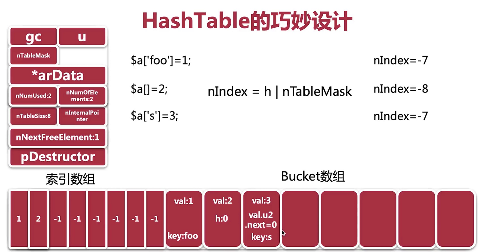
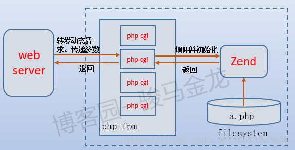
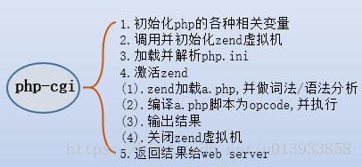
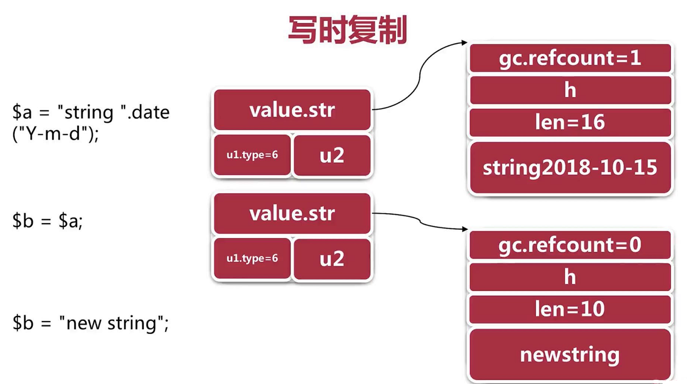
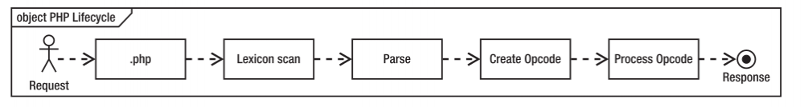
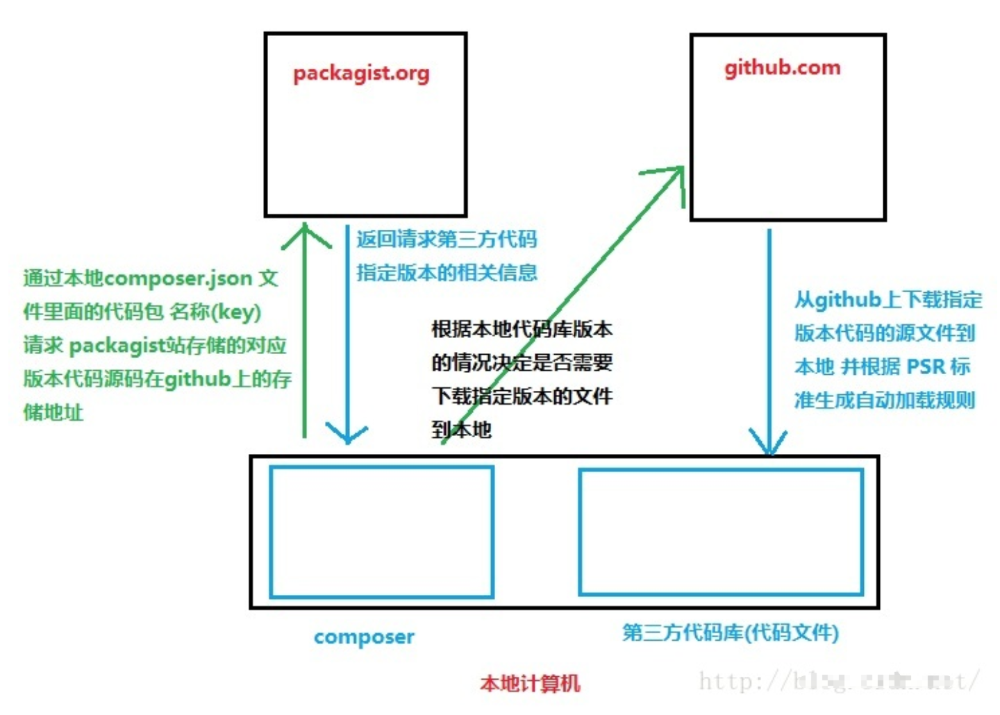

# PHP

## PHP基础

### 什么是引用变量?在php当中，用什么符号定义引用变量？

按值传递：函数范围内对值的任何改变在函数外部都会被忽略 

按引用传递：函数范围内对值的任何改变在函数外部也能反映出这些修改  &表示传引用

优缺点：     

按值传递时，php必须复制值。特别是对于大型的字符串和对象来说，这将会是一个代价很大的操作。     

按引用传递则不需要复制值，对于性能提高很有好处。


用不同的名字访问同一个变量内容 用&符号

PHP引用变量的原理   COW机制 copy on write  （linux机制）

https://juejin.im/post/5bd96bcaf265da396b72f855

zval 结构体   xdebug_debug_zval

unset 不会销毁内存 只会减少引用

```php
<?php
    $data = ["a","b","c"];

    foreach($data as $key=>$val){
        $val = &$data[$key];
    }

    var_dump($data);
/*
	key = 0 val = a  val data[0] => a
    key = 1 val = b  val data[0] => b  val data[1] =>b
    key = 2 val = c  val data[1] => c val data[2] => c
    
    $data = ["b","c","c"]
*/

```


引用相关题目

```php
<?php
	function &myFunc(){
		static $b = 10;
		return $b;
	}
	$a = myFunc();// a= 10
	$a = &myFunc();
	$a = 100;
	echo myFunc();//100
```

```php
<?php
	$var1 = 5;
	$var2 = 10;
	function foo(&$my_var){
		global $var1;//5
		$var1 += 2;//7
		$var2 = 4;//4
		$my_var += 3;//8 
		return $var2;
	}
	$my_var = 5;
	echo foo($my_var)."\n";//4
	echo $my_var."\n";//8
	echo $var1."\n";//7
	echo $var2."\n";//10
	$bar = "foo";
	$my_var = 10;
	echo $bar($my_var)."\n";//4
```


PHP静态变量相关 

```php
<?php
	$count = 5;
	function get_count(){
        static $count;
        return $count++;
    }
	echo $count; // 5
	++$count;  //6

	echo get_count(); //null
	echo get_count(); // 1
?>
```


### PHP字符串的定义方式和区别

单引号  不能解析变量  不能解析转义字符 只能解析单引号 和 反斜线  效率高于双引号

双引号  可以解析变量  解析转义字符

heredoc  <<<EOT  类似双引号

EOT

newdoc <<<'EOT'  类似单引号

EOT


在PHP中，heredoc是一种特殊的字符串，它的结束标志必须?

成对出现

$a = <<<EOD

good test $mmm

EOD;


### 数据类型那些需要注意？

float 不能用于精确的运算 转换二进制

false  0,0.0,'','0',false,array(),null

数组

超全局数组  
```php
$GLOBALS  $_GET  $_POST $_REQUEST $_SESSION $_COOKIE $_SERVER $_FILES $_ENV
$GLOBALS 包含所有
$_REQUEST 包含 $_GET  $_POST $_COOKIE
$_SERVER['SERVER_ADDR']
$_SERVER['SERVER_NAME']
$_SERVER['REQUEST_TIME']
$_SERVER['QUERY_STRING']
$_SERVER['HTTP_REFERER']
$_SERVER['HTTP_USER_AGENT']
$_SERVER['REMOTE_ADDR']
$_SERVER['REQUEST_URI']
$_SERVER['PATH_INFO']
```


### 常量如何定义？

const    语言结构 定义类常量   效率更高

define  函数   

预定义常量 

```php
__FILE__ __LINE__ __DIR__ __FUNCTION__ __CLASS__ __TRAIT__ __METHOD__ __NAMESPACE__
```


### 运算符考察？

foo() 和 @foo() 的区别 

@ 该表达式出现的任何错误信息都会被屏蔽

递增递减不影响bool值

递减null没效率  递增null值为1

|| && and  or

$a = false || true;  先运算右边  a=true

$b = false or true; 先运算左边 b= false

```php
<?php
	$a = 0;
	$b = 0;
	if( $a = 3 > 0 || $b = 3 > 0){  // a = true b = 0
		$a++;  //true
		$b++;  // 1 
		echo $a."\n"; // 1
		echo $b."\n"; // 1
	}
```


### 遍历数组的三种方式及区别

使用for()循环  只能遍历数组  对存在键值映射的关联数组无能为力

使用foreach()循环  可以遍历索引、关联数组、对象。  对数组进行reset  foreach直接通过结构体中next指针获取下一个值，而for循环需要根据key先进行一次hash才得到值。

使用while() list() each()组合循环  不会对数组reset 


switch 只能判断整型 浮点 字符串   continue等价break  for循环可以continue  2；


### 自定义函数


时间函数

date  strtotime  **mktime** time microtime date_default_timezone_set

ip处理函数

ip2long  long2ip

打印处理

print  echo  printf  sprintf   print_r var_dump var_export

  echo 和 print不是一个函数，是一个语言结构

  int print(string $arg), 只有一个参数 始终返回1

  echo arg1,arg2; 可以输出多个参数，返回void

  echo和print只能打印出string，不能打印出结构

  print_r能打印出结构

  比如 

  $arr = array("key"=>"value");

  print_r($arr);


序列化和反序列化

unserialize() serialize()

字符串处理函数

implode  explode join是implode的别名 strrev trim ltrim rtrim strstr number_format

数组处理函数

array_keys array_values  array_diff array_intersect array_merge array_shift array_unshift array_pop array_push sort 等

文件操作函数

basename  dirname pathinfo opendir readdir closedir rewinddir rmdir mkdir  filesize disk_free_space 

disk_total_space copy  unlink    filetype file|dir rename 移动 ftruncate file_exists is_readable 

is_writeable  is_executable filectime fileatime filemtime flock ftell fseek rewind


如何给文件加锁？

flock


### 正则表达式

后向引用

```php
<?php
 	$str = '<b>abc</b>';
	$pattern = '/<b>(.*)<\/b>/';
	echo preg_replace($pattern,'\\1',$str);
// abc 
```

贪婪模式

```php
<?php
$str = '<b>abc</b><b>bcd</b>';
$pattern = '/<b>(.*?)<\/b>/';
#$pattern = '/<b>(.*)<\/b>/U';//取消贪婪模式
echo preg_match_all($pattern,$str,$result);
var_dump($result);
```

preg_match preg_match_all preg_replace preg_split

中文匹配  utf-8汉字编码范围  0x4e00-0x9fa5

ansi（gb2312）模式下 0xb0-0xf7,0xa1-0xfe

```php
<?php
    $str = "中文";
    $pattern = '/[\x{4e00}-\x{9fa5}]+/u';//utf8下
    $pattern = "/([".chr(0xb0)."-".chr(0xf7)."][".chr(0xa1)."-".chr(0xfe)."])/" ;//gb2312下
    preg_match($pattern,$str,$result);
    var_dump($result);
```


## PHP底层


### PHP7数组底层实现




PHP 中的数组是使用 HashTable 实现的
        HashTable 通过中间映射表实现顺序读取，中间映射表和元素数组（Bucket）使用连续的内存空间

PHP 采用的是其中的链地址法解决hash冲突，将冲突的 Bucket 串成链表，这样中间映射表映射出的就不是某一个元素，而是一个 Bucket 链表，通过散列函数定位到对应的 Bucket 链表时，需要遍历链表，逐个对比 Key 值，继而找到目标元素。

在空间已满时，会触发自动扩容机制，导致重建索引

Zvals不再单独分配，所以这节省了16个字节的内存分配冗余。
Buckets也不用再单独分配，所以又节省了16个字节的内存分配冗余。
对于简单类型的值，zval本身就少了16个字节。


参考：

这篇文章讲的好

<https://gywbd.github.io/posts/2014/12/php7-new-hashtable-implementation.html>

<https://php.net/manual/zh/language.types.array.php>

https://juejin.im/post/5b967696e51d450e452a74d8

https://blog.csdn.net/wuxing26jiayou/article/details/80036963


### PHP代码执行过程

​	php5.4的代码执行流程

​	1、将代码转换为语言片段 tokens  <https://www.php.net/manual/zh/tokens.php>
​	2、将Tokens转换成简单而有意义的表达式 
​	3、编译成opcode(opcache) 
​	4、zeng引擎顺序执行 opcode
​	参考：https://blog.csdn.net/d_o_n_g2/article/details/77863677
​	http://www.laruence.com/2008/06/18/221.html


​	php7的代码执行流程	

​		PHP5 : PHP代码 -> Parser语法解析 -> OPCODE -> 执行 
​		PHP7 : PHP代码 -> Parser语法解析 -> AST -> OPCODE -> 执行

​	增加抽象语法树AST

​		 https://wiki.php.net/rfc/abstract_syntax_tree

​		编译器与解析器完全分离

​		执行时间整体上大概有 10% 到 15% 的提升，但是内存消耗也有增加


### FPM原理

php-fpm采用master/worker架构设计

master 

 1. cgi初始化阶段

 2. php环境初始化阶段

 3. php-fpm初始化阶段

 4. php-fpm运行阶段


worker 

 1. 接收客户端请求：执行fcgi_accept_request函数，其内部通过调用accept 函数获取客户端请求。

 2. 处理请求阶段：首先，分别调用fpm_request_info、php_request_startup获取请求内容及注册全局变量($_GET、$_POST、$_SERVER、$_ENV、$_FILES)；然后根据请求信息调用php_fopen_primary_script访问脚本文件；最后交给php_execute_script执行。php_execute_script内部调用zend_execute_scripts方法将脚本交给zend引擎处理。 

 3. 请求结束阶段：执行php_request_shutdown函数。此时 回调register_shutdown_function注册的函数及__destruct()方法，发送响应内容、释放内存等操作。

​	总结：php-fpm采用master/worker架构设计， master进程负责CGI、PHP公共环境的初始化及事件监听操作。worker进程负责请求的处理功能。在worker进程处理请求时，无需再次初始化PHP运行环境，这也是php-fpm性能优异的原因之一。

​	参考：https://blog.csdn.net/mijar2016/article/details/53311986


fpm三种模式

pm = dynamic  默认选项 子进程数会在最大和最小数范围中变化，还没有完，闲置的子进程数还可以由另2个配置控制，分别是pm.min_spare_servers和pm.max_spare_servers

pm = static，始终保持一个固定数量的子进程

pm=ondemand的作用：把内存放在第一位，只有当有需要的时候，子进程才会被产生。事情做完之后，子进程会留在内存中10秒钟时间（pm.process_idle_timeout = 10s），然后自己退出。


平滑重启原理

假设128个php-cgi进程中有50个进程正在处理PHP程序，而剩余的78个进程处于闲置状态，php-fpm接到平滑重启信号后，会kill掉78个闲置进程，然后新启动128个进程，新请求交给新启动的进程来处理，而那50个进程，只有等到它们处理完自己当前正在执行的PHP程序后，才会被干掉。


### PHP 运行模式与运行原理

多进程模型：由于PHP是多进程模型，不同请求间互不干涉，这样保证了一个请求挂掉不会对全盘服务造成影响，当然，时代发展，PHP也早已支持多线程模型。


<https://segmentfault.com/a/1190000014913877>

目前常见的4种PHP运行模式

1. CGI通用网关接口模式
2. FAST-CGI模式
3. CLI命令行模式
4. 模块模式


#### CGI通用网关接口模式

每有一个用户请求，都会先要创建cgi的子进程，然后处理请求，处理完后结束这个子进程

cgi是一种为了保证web server传递过来的数据是标准格式的通用网关接口协议

比较老，比较原始，大多已经不用了


#### FAST-CGI模式

是cgi的升级版本，FastCGI 像是一个常驻 (long-live) 型的 CGI，它可以一直执行着，只要激活后，不会每次都要花费时间去fork 一次，也是一种协议

FastCGI的工作原理是：

　　(1)、Web Server启动时载入FastCGI进程管理器【PHP的FastCGI进程管理器是PHP-FPM(php-FastCGI Process Manager)】（IIS ISAPI或Apache Module);

　　(2)、FastCGI进程管理器自身初始化，启动多个CGI解释器进程 (在任务管理器中可见多个php-cgi.exe)并等待来自Web Server的连接。

　　(3)、当客户端请求到达Web Server时，FastCGI进程管理器选择并连接到一个CGI解释器。Web server将CGI环境变量和标准输入发送到FastCGI子进程php-cgi。

　　(4)、FastCGI子进程完成处理后将标准输出和错误信息从同一连接返回Web Server。当FastCGI子进程关闭连接时，请求便告处理完成。FastCGI子进程接着等待并处理来自FastCGI进程管理器（运行在 WebServer中）的下一个连接。在正常的CGI模式中，php-cgi.exe在此便退出了。

　　在CGI模式中，可以想象 CGI通常有多慢。每一个Web请求PHP都必须重新解析php.ini、重新载入全部dll扩展并重初始化全部数据结构。使用FastCGI，所有这些都只在进程启动时发生一次。一个额外的好处是，持续数据库连接(Persistent database connection)可以工作。


#### CLI命令行模式

一般使用调用脚本、查看php信息时会使用到该模式

php -r"phpinfo();" |less 分页显示


#### 模块模式

##### Apache + mod_php

##### lighttp + spawn-fcgi

##### nginx + PHP-FPM

运行原理
PHP-CGI：fast-cgi是一种协议，而php-cgi是实现了这种协议的进程。不过这种实现比较烂。它是单进程的，一个进程处理一个请求，处理结束后进程就销毁


PHP - FPM：是对php-cgi的改进版，它直接管理多个php-cgi进程/线程。也就是说，php-fpm是php-cgi的进程管理器因此它也算是fastcgi协议的实现


php的运行原理，就是在服务器启动时，自动载入PHP-FPM进程管理器，从而管理多个PHP-CGI进程来准备响应用户的请求，如下图所示：






由于php-cgi是随服务器启动载入的，所以初始化变量只会发生一次


FastCGI

​	与cgi区别：cgi是请求过来再初始化进程并执行代码，FastCGI预先初始化一些进程，请求过来可以直接分发处理，并且进程重复使用，实现了一个进程池。
​	与php-fpm关系：php-fpm是一个被纳入php核心的FastCGI进程管理程序（FastCGI Process Manager），FastCGI模式的关键部分是对fastcgi进程的有效管理。
​	与nginx通讯：nginx通过tcp socket或者unix socket与fastcgi进程通讯。


nginx与php-fpm两种通信方式

unix socket方式要比tcp的方式快，而且消耗资源少，因为socket之间在nginx和php-fpm的进程之间通信，而tcp需要经过本地回环驱动，还要申请临时端口和tcp相关资源。
    
unix socket会显得不是那么稳定，当并发连接数爆发时，会产生大量的长时缓存，在没有面向连接协议支撑的情况下，大数据包很有可能就直接出错并不会返回异常。而TCP这样的面向连接的协议，多少可以保证通信的正确性和完整性


### PHP垃圾回收机制------------------

​	背景：
​		php中内存对象就是zval，而计数器就是refcount__gc。

​	为每个内存对象分配一个引用计数器，当一个内存对象建立时计数器初始化为1
​	以后每有一个新变量引用此内存对象，则计数器加1，而每当减少一个引用此内存对象的变量则计数器减1，
​	当垃圾回收机制运作时，将所有计数器为0的内存对象销毁并回收其占用的内存。

​	5.3后 改进了垃圾回收的算法  同步算法
​	1、并不是每次refcount减少时都进入回收周期，只有根缓冲区满额后在开始垃圾回收。
​	2、可以解决循环引用问题。
​	3、可以总将内存泄露保持在一个阈值以下

​	参考：https://segmentfault.com/a/1190000008481434


https://blog.csdn.net/phpkernel/article/details/5734743  [待看]

遍历缓存区，再对当前变量的所有成员进行遍历，然后把成员的refcount减1(如果成员还包含子成员则也进行递归遍历，其实就是深度优先的遍历)，最后再检查当前变量的引用，如果减为了0则为垃圾。


<https://github.com/pangudashu/php7-internal/blob/master/5/gc.md>

php底层结构  垃圾机制 

<https://www.cnblogs.com/xinghun/p/5660051.html>


### PHP内存分配----待整理---------------------

Zend内存管理器

PHP的内存管理实现了自己的内存池，使得PHP内核在真正使用内存之前，先申请一块内存，当我们申请内存时就从内存池中分出一部分内存块，若内存块不够再继续申请新的内存，提高了内存分配的效率。PHP还实现了垃圾回收机制（Garbage Collection）及写时复制（Copy On Write）以进一步优化。


string cow




参考：

http://mars.run/2016/01/Understanding-PHP-memory-management/


### PHP错误处理机制

 PHP7 以前的 PHP 版本：发生了 E_ERROR 错误，无法捕获，导致数据库的事务无法回滚造成数据不一致。


这种 Error 异常可以像 Exception 异常一样被第一个匹配的 try / catch 块所捕获。如果没有匹配的 catch 块，则调用异常处理函数（事先通过 set_exception_handler() 注册）进行处理。 如果尚未注册异常处理函数，则按照传统方式处理：被报告为一个致命错误（Fatal Error）。

Error 类并非继承自 Exception 类，所以不能用 catch (Exception $e) { ... } 来捕获 Error。你可以用 catch (Error $e) { ... }，或者通过注册异常处理函数（ set_exception_handler()）来捕获 Error。


问题：哪些错误不能被php7捕获？

https://www.imooc.com/learn/380


https://segmentfault.com/a/1190000009504337

​	16个错误级别

<https://php.net/manual/zh/errorfunc.constants.php>

​	参考：

[风雪之隅--我们什么时候应该使用异常?](http://www.laruence.com/2012/02/02/2515.html)

[风雪之隅--深入理解PHP原理之异常机制](http://www.laruence.com/2010/08/03/1697.html)

<https://juejin.im/entry/5987d2ff6fb9a03c314fe732#fnref:6>

https://novnan.github.io/PHP/throwable-exceptions-and-errors-in-php7/

https://www.php.net/manual/zh/language.errors.php7.php


## PHP7

https://www.imooc.com/learn/1085


鸟哥关于PHP7的PPT  111

<https://www.slideshare.net/slideshow/embed_code/key/CEFA3ngp5V9GoJ>


### PHP7 新特性有哪些？

https://www.php.net/manual/zh/migration70.new-features.php

示例:<https://learnku.com/articles/25873>

标量类型说明

返回值类型声明 	

null合并运算符

```php
$username = $_GET['user'] ?? 'nobody';
```

太空船操作符（组合比较符）	

```php
#当$a小于、等于或大于$b时它分别返回-1、0或1
echo 1 <=> 1; // 0
echo 1 <=> 2; // -1
echo 2 <=> 1; // 1
```

通过 define() 定义常量数组 

匿名类

Unicode codepoint 转译语法 

Closure::call() 

为unserialize()提供过滤 

过去的 PHP，处理致命错误几乎是不可能的。致命错误不会调用由 set_error_handler() 设置的处理方式，而是简单的停止脚本的执行


### 为什么 PHP7 比 PHP5 性能提升了？

1、变量存储字节减小，减少内存占用，提升变量操作速度   24字节-》16字节
2、改善数组结构，数组元素和hash映射表被分配在同一块内存里，降低了内存占用、提升了 cpu 缓存命中率
3、改进了函数的调用机制，通过优化参数传递的环节，减少了一些指令，提高执行效率

​	opcache开启，性能显著提升几倍。


php7数组底层实现？


  https://www.zhihu.com/question/38148900


## php自动加载机制原理 

​	PHP5 在使用一个类时，如果发现这个类没有加载，就会自动运行 _autoload () 函数
​	缺点：问题出现在 autoload () 是全局函数只能定义一次  php7.2弃用
​	spl_autoload_register SPL 是 Standard PHP Library (标准 PHP 库) 的缩写。
​	PSR 也定义了 自动加载标准
​	参考：https://learnku.com/articles/4681/analysis-of-the-principle-of-php-automatic-loading-function


## 主流 PHP 框架特点

用过yaf，ci，yii1，yii2，Laravel	

https://www.imooc.com/learn/702


Laravel
​		易于访问，功能强大，并提供大型，强大的应用程序所需的工具
​		简单快速的路由引擎
​		强大的依赖注入容器
​		富有表现力，直观的数据库 ORM
​		提供数据库迁移功能
​		灵活的任务调度器
​		实时事件广播
​		优点：优雅，框架结构组织清晰（抽象了中间件，任务，服务等模块），提供的artisan开发工具开发效率高，社区活跃完善，并且提供了简化的轻量级框架lumen

​		缺点：貌似代码有些过于优雅丧失了一些性能

基于组件式的框架，所以比较臃肿


Yii2:
		优点：gii蛮不错的，简化了开发流程，可以生成绝大数的代码，开发后台等效率还是蛮高的
		缓存机制  modules 设计 
		ORM 

​		widget

​		扩展性强  结构简单优雅  实用功能丰富  性能高

​		Yii提供了 今日Web 2.0应用开发所需要的几乎一切功能。事实上，Yii是最有效率的PHP框架之一。

​		缺点：前后端完全的分离的趋势下，yii2前后端的耦合的还是有些重了

​			学习成本高，相比yaf性能不高

Yaf：

优点:

​	执行效率高，轻量级框架，可扩展性强

缺点：

​	高版本兼容性差，底层代码可读性差，需要安装扩展，功能单一，开发需要编写大量的插件


用C语言开发的PHP框架, 相比原生的PHP, 几乎不会带来额外的性能开销.
所有的框架类, 不需要编译, 在PHP启动的时候加载, 并常驻内存.
更短的内存周转周期, 提高内存利用率, 降低内存占用率.
灵巧的自动加载. 支持全局和局部两种加载规则, 方便类库共享.
高性能的视图引擎.
高度灵活可扩展的框架, 支持自定义视图引擎, 支持插件, 支持自定义路由等等.
内建多种路由, 可以兼容目前常见的各种路由协议.
强大而又高度灵活的配置文件支持. 并支持缓存配置文件, 避免复杂的配置结构带来的性能损失.
在框架本身,对危险的操作习惯做了禁止.
更快的执行速度, 更少的内存占用.


## 为什么会有502

502 表示网关错误，当 PHP-CGI 得到一个无效响应，网关就会输出这个错误

Nginx本身设置等cgi接口返回的数据延时太短

PHP执行超时

​	php.ini 的 memory_limit 过小
​	php-fpm.conf 中 max_children、max_requests 设置不合理
​	php-fpm.conf 中 request_terminate_timeout、max_execution_time 设置不合理
​	php-fpm 进程处理不过来，进程数不足、脚本存在性能问题


## PHP魔术方法有哪些？

<https://www.php.net/manual/zh/language.oop5.magic.php>

__construct()，类的构造函数

__destruct()，类的析构函数

__call()，在对象中调用一个不可访问方法时调用

__callStatic()，用静态方式中调用一个不可访问方法时调用

__get()，获得一个类的成员变量时调用

__set()，设置一个类的成员变量时调用

__isset()，当对不可访问属性调用isset()或empty()时调用

__unset()，当对不可访问属性调用unset()时被调用。

__sleep()，执行serialize()时，先会调用这个函数

__wakeup()，执行unserialize()时，先会调用这个函数

__toString()，类被当成字符串时的回应方法

__invoke()，调用函数的方式调用一个对象时的回应方法

__set_state()，调用var_export()导出类时，此静态方法会被调用。

<https://www.php.net/manual/zh/language.oop5.magic.php#object.set-state>

```php

eval('$b = ' . var_export($a, true) . ';'); // $b = A::__set_state(array(
                                            //    'var1' => 5,
                                            //    'var2' => 'foo',
                                            // ));
```


__clone()，当对象复制完成时调用

__autoload()，尝试加载未定义的类

__debugInfo()，打印所需调试信息


## PHP加速器配置神器opcache

PHP5以前用的加速器

​	APC
​	eAccelerator
​	Xcache

php7 + opcache

PHP 5.5.0 及后续版本中已经绑定了 OPcache 扩展

没有opcache




service php-fpm reload

第一个问题是做版本回滚时，由于版本回滚后的文件修改时间比现有opcache缓存的文件时间要往前一些，所以可能会导致opcache不会清除缓存，需要手动reload。

第二个问题是做版本发布时，一般都是sync方式，可能会出现文件发布一半时被opcache缓存，用户访问会报程序错误，这个主要是因为文件内容缓存了一半，但是文件的时间戳不会在改变，所以就算opcache检测时也不会去读取新的文件了，需要手动reload。


<http://blog.itpub.net/31559985/viewspace-2636653/>


## PHP RPC框架

​	远程调用原理
​		1、首先A与B之间建立一个TCP连接；
​		2、然后A把需要调用的方法名（这里是remoteAdd）以及方法参数（10， 20）序列化成字节流发送出去；
​		3、B接受A发送过来的字节流，然后反序列化得到目标方法名，方法参数，接着执行相应的方法调用（可能是localAdd）并把结果30返回；
​		4、A接受远程调用结果,输出30。

​	php中流行的rpc框架有哪些
​	phprpc，yar, thrift, gRPC, swoole, hprose


## psr规范

​	目前有10几个规范  自动加载的规范 定义了自动加载的目录以及命名空间

​	https://www.php-fig.org/psr/

​	<http://psr.phphub.org/>

必须 (MUST) ：绝对，严格遵循，请照做，无条件遵守；
一定不可 (MUST NOT) ：禁令，严令禁止；
应该 (SHOULD) ：强烈建议这样做，但是不强求；
不该 (SHOULD NOT) ：强烈不建议这样做，但是不强求；
可以 (MAY) 和 可选 (OPTIONAL) ：选择性高一点，在这个文档内，此词语使用较少；


## PHP各版本区别

​	PHP5.2 以前：autoload, PDO 和 MySQLi, 类型约束
​	PHP5.2：JSON 支持
​	PHP5.3：匿名函数，新增魔术方法，命名空间，后期静态绑定，Heredoc 和 Nowdoc, const, 三元运算符，Phar
​	PHP5.4：Short Open Tag, 数组简写形式，Traits, 内置 Web 服务器，细节修改
​	PHP5.5：yield, list() 用于 foreach, 细节修改
​	PHP5.6: 常量增强，可变函数参数，命名空间增强    2018年底 不再支持
​	PHP7.0版本:新增空合并运算符、变量类型声明、返回值类型声明、太空船操作符、匿名类、Unicode codepoint 转译语法,Closure::call为 unserialize(提供过滤,IntlChar,预期,Group use declarations 等新特性。
​	PHP7.1: 异常处理  可为空（Nullable）类型 void返回类型  
​	PHP7.2: ??语法  

参考：

https://www.php.net/eol.php  

https://www.php.net/supported-versions.php

<https://blog.csdn.net/looklookmememe/article/details/78505374>


## yield -----------------------------

yield的本质是生成器，英文名字叫做Generator
生成器为可中断的函数


## PHP并发请求如何实现 

​	curl_multi相关函数
​	参考：https://segmentfault.com/a/1190000016343861


## 什么是依赖注入？控制反转？IOC容器

a依赖b，但a不控制b的创建和销毁，仅使用b，那么b的控制权交给a之外处理，这叫控制反转（IOC），而a要依赖b，必然要使用b的instance，那么

通过a的接口，把b传入；
通过a的构造，把b传入；
通过设置a的属性，把b传入；
这个过程叫依赖注入（DI）。


如果一个类A 的功能实现需要借助于类B，那么就称类B是类A的<b>依赖</b>，如果在类A的内部去实例化类B，那么两者之间会出现较高的<b>耦合</b>，一旦类B出现了问题，类A也需要进行改造，如果这样的情况较多，每个类之间都有很多依赖，那么就会出现牵一发而动全身的情况，<b>程序会极难维护</b>，并且很容易出现问题。要解决这个问题，就要把A类对B类的控制权抽离出来，交给一个第三方去做，把控制权反转给第三方，就称作<b>控制反转（IOC Inversion Of Control）</b>。<b>控制反转是一种思想</b>，是能够解决问题的一种可能的结果，而<b>依赖注入（Dependency Injection）</b>就是其最典型的实现方法。由第三方（<b>我们称作IOC容器</b>）来控制依赖，把他通过<b>构造函数、属性或者工厂模式</b>等方法，注入到类A内，这样就极大程度的对类A和类B进行了<b>解耦</b>。


好处：可以解耦调用与实现，方便的替换实现，也有利于测试。

参考：https://www.zhihu.com/question/32108444


## 如何检查PHP脚本的执行效率

​	PHP脚本的执行效率
​	　　1, 代码脚本里计时。
​	　　2, xdebug统计函数执行次数和具体时间进行分析。,最好使用工具winCacheGrind分析    php效率用xhprof
​	　　3, 在线系统用strace跟踪相关进程的具体系统调用。

​	数据库SQL的效率
​	　　sql的explain(mysql),启用slow query log记录慢查询。
​	　　通常还要看数据库设计是否合理，需求是否合理等。


  升级php7

  使用xdebug加wingrid


## 选择ts版本还是nts版本？

ts 线程安全  多线程访问，采取了加锁机制

nts 非线程安全


apache  调用使用ts版本

nginx+fpm fastcgi选择nts


### Socket 编程的基本步骤 (TCP/UDP)


## SESSION

### Cookie与Session的原理？区别

大多数的应用都是用 Cookie 来实现Session跟踪用户，第一次创建Session的时候，服务端会在HTTP协议中告诉客户端，需要在 Cookie 里面记录一个Session ID，以后每次请求把这个会话ID发送到服务器。

Session是在服务端保存的一个数据结构，用来跟踪用户的状态，这个数据可以保存在集群、数据库、文件中；
Cookie是客户端保存用户信息的一种机制，用来记录用户的一些信息，也是实现Session的一种方式。


### session什么时候被创建？

如果已包含一个session id则说明以前已经为此客户端创建过session，
服务器就按照session id把这个session检索出来使用，
若没有创建过，则创建一个新的Session。前提是开启session


### session何时被删除？

A．程序调用HttpSession.invalidate()
B．距离上一次收到客户端发送的session id时间间隔超过了session的最大有效时间
C．服务器进程被停止
再次注意关闭浏览器只会使存储在客户端浏览器内存中的session cookie失效，不会使服务器端的session对象失效


### 多服务器如何共用session？

​	mount文件

​	使用mysql

​	客户端记录session

​	redis->memcache   session_set_handle

​	分布式redis集群，不同用户访问不同分片 主备2个节点。

​	参考：
​	https://segmentfault.com/q/1010000003099147


### 如何修改SESSION的生存时间？

 session有效期默认是1440秒（24分钟） PHPSESSID 名

  方法1: 将php.ini中的session.gc_maxlifetime设置为9999重启php-fpm

  方法2: 其实 Session 还提供了一个函数 session_set_cookie_params(); 来设置 Session 的生存期的，该函数必须在 session_start() 函数调用之前调用：


默认情况下，PHP把会话（session）数据存储在文件系统里。


### 浅谈SAML, OAuth, OpenID和SSO, JWT和Session

<https://www.jianshu.com/p/ff9d3ad817ca>


## php7 多线程--待验证

PHP中创建多线程、多进程有哪些方式？互斥信号该如何实现？

多进程pcntl 
多线程使用pthreads扩展；多进程使用proc_open/popen函数；pthreads的Mutex类可以操作互斥信号；
我个人不建议使用多线程，PHP原生多进程模型，如果有并行任务要处理，可以有消息队列，或者用swoole来处理

https://www.cnblogs.com/jkko123/p/8921260.html


## 全文索引解决方案

​	solr/lucene ik分词
​	sphinx 分词
​	xunsearch 自带分词 可以自定义词库
​	阿里云的opensearch


## 列出几个中文分词工具？

​	ik分词
​	xunsearch


## PHP 反射

反射是指在PHP运行状态中，扩展分析PHP程序，导出或提出关于类、方法、属性、参数等的详细信息，包括注释。

应用场景：

一个是对对象进行调试，另一个是获取类的信息。


## PHP strlen和mb_strlen的区别

在strlen计算中，对待一个UTF8的中文字符，处理为3个字节长度
mb_strlen的内码选择为UTF-8的时候，则会将中文字符当成一个字符


## 抽象类和接口有什么区别


接口的使用方式是通过关键字implements来实现的，而对于抽象类的操作是使用类继承的关键字extends实现的

接口没有数据成员，但是抽象类有数据成员，抽象类可以实现数据的封装。

接口没有构造函数，抽象类可以有构造函数。

接口中的方法都是public类型，而抽象类中的方法可以使用private、protected或public来修饰。

一个类可以同时实现多个接口，但是只能实现一个抽象类。


相同点：函数体内不能写任何东西，连两个大括号都不能写！！！如：function getName();这样就行了


## 谈谈PHP的设计模式，说说其用途？-------------------

https://www.awaimai.com/patterns

https://www.jianshu.com/p/807bc228dbc2

​	简单工厂模式   经典数据库连接，缓存设计


​	简单工厂模式:用来生产同一等级结构中的任意产品。对与增加新的产品，无能为力

​	工厂模式 ：用来生产同一等级结构中的固定产品。（支持增加任意产品）

​	抽象工厂 ：用来生产不同产品族的全部产品。（对于增加新的产品，无能为力；支持增加产品族）


### 	PHP简单工厂模式、工厂方法模式和抽象工厂模式比较


​	PHP工厂模式概念：工厂模式是一种类，它具有为您创建对象的某些方法。您可以使用工厂类创建对象，而不直接使用 new。这样，如果您想要更改所创建的对象类型，只需更改该工厂即可。使用该工厂的所有代码会自动更改。

​	根据抽象程度不同，PHP工厂模式分为：简单工厂模式、工厂方法模式和抽象工厂模式

### 	简单工厂模式:


​	 

​	/**

​	*简单工厂模式与工厂方法模式比较。

​	*简单工厂又叫静态工厂方法模式，这样理解可以确定，简单工厂模式是通过一个静态方法创建对象的。

​	*/

​	interface people {

​	function jiehun();

​	}

​	class man implements people{

​	function jiehun() {

​	echo '送玫瑰，送戒指！<br>';

​	}

​	}

​	 

​	class women implements people {

​	function jiehun() {

​	echo '穿婚纱！<br>';

​	}

​	}

​	 

​	class SimpleFactoty {

​	// 简单工厂里的静态方法

​	static function createMan() {

​	return new man;

​	}

​	static function createWomen() {

​	return new women;

​	}

​	}

​	 

​	$man = SimpleFactoty::createMan();

​	$man->jiehun();

​	$man = SimpleFactoty::createWomen();

​	$man->jiehun();

​	php


### 	工厂方法模式：


​	 

​	<?php

​	/*

​	*工厂方法模式：

​	*定义一个创建对象的接口，让子类决定哪个类实例化。 他可以解决简单工厂模式中的封闭开放原则问题。<www.phpddt.com整理>

​	*/

​	interface people {

​	function jiehun();

​	}

​	class man implements people{

​	function jiehun() {

​	echo '送玫瑰，送戒指！<br>';

​	}

​	}

​	 

​	class women implements people {

​	function jiehun() {

​	echo '穿婚纱！<br>';

​	}

​	}

​	 

​	interface createMan { // 注意了，这里是简单工厂本质区别所在，将对象的创建抽象成一个接口。

​	function create();

​	 

​	}

​	class FactoryMan implements createMan{

​	function create() {

​	return new man;

​	}

​	}

​	class FactoryWomen implements createMan {

​	function create() {

​	return new women;

​	}

​	}

​	 

​	class Client {

​	// 简单工厂里的静态方法

​	function test() {

​	$Factory = new FactoryMan;

​	$man = $Factory->create();

​	$man->jiehun();

​	$Factory = new FactoryWomen;

​	$man = $Factory->create();

​	$man->jiehun();

​	}

​	}

​	 

​	$f = new Client;

​	$f->test();

​	php


### 	抽象工厂模式： 


​	 

​	<?php

​	/*

​	抽象工厂：提供一个创建一系列相关或相互依赖对象的接口。

​	注意：这里和工厂方法的区别是：一系列，而工厂方法则是一个。

​	那么，我们是否就可以想到在接口create里再增加创建“一系列”对象的方法呢？

​	*/

​	interface people {

​	function jiehun();

​	}

​	class Oman implements people{

​	function jiehun() {

​	echo '美女，我送你玫瑰和戒指！<br>';

​	}

​	}

​	class Iman implements people{

​	function jiehun() {

​	echo '我偷偷喜欢你<br>';

​	}

​	}

​	 

​	class Owomen implements people {

​	function jiehun() {

​	echo '我要穿婚纱！<br>';

​	}

​	}

​	 

​	class Iwomen implements people {

​	function jiehun() {

​	echo '我好害羞哦！！<br>';

​	}

​	}

​	 

​	interface createMan { // 注意了，这里是本质区别所在，将对象的创建抽象成一个接口。

​	function createOpen(); //分为 内敛的和外向的

​	function createIntro(); //内向

​	 

​	}

​	class FactoryMan implements createMan{

​	function createOpen() {

​	return new Oman;

​	}

​	function createIntro() {

​	return new Iman;

​	}

​	}

​	class FactoryWomen implements createMan {

​	function createOpen() {

​	return new Owomen;

​	}

​	function createIntro() {

​	return new Iwomen;

​	}

​	}

​	 

​	class Client {

​	// 简单工厂里的静态方法

​	function test() {

​	$Factory = new FactoryMan;

​	$man = $Factory->createOpen();

​	$man->jiehun();

​	$man = $Factory->createIntro();

​	$man->jiehun();

​	$Factory = new FactoryWomen;

​	$man = $Factory->createOpen();

​	$man->jiehun();

​	$man = $Factory->createIntro();

​	$man->jiehun();

​	}

​	}

​	 

​	$f = new Client;

​	$f->test();

​	php


​	区别：

​	简单工厂模式:用来生产同一等级结构中的任意产品。对与增加新的产品，无能为力

​	工厂模式 ：用来生产同一等级结构中的固定产品。（支持增加任意产品）   

​	抽象工厂 ：用来生产不同产品族的全部产品。（对于增加新的产品，无能为力；支持增加产品族）  

​	以上三种工厂 方法在等级结构和产品族这两个方向上的支持程度不同。所以要根据情况考虑应该使用哪种方法

​	适用范围：

​	简单工厂模式：

​	工厂类负责创建的对象较少，客户只知道传入工厂类的参数，对于如何创建对象不关心。

​	工厂方法模式：

​	当一个类不知道它所必须创建对象的类或一个类希望由子类来指定它所创建的对象时，当类将创建对象的职责委托给多个帮助子类中得某一个，并且你希望将哪一个帮助子类是代理者这一信息局部化的时候，可以使用工厂方法模式。

​	抽象工厂模式：

​	一个系统不应当依赖于产品类实例何如被创建，组合和表达的细节，这对于所有形态的工厂模式都是重要的。这个系统有多于一个的产品族，而系统只消费其 中某一产品族。同属于同一个产品族的产品是在一起使用的，这一约束必须在系统的设计中体现出来。系统提供一个产品类的库，所有的产品以同样的接口出现，从 而使客户端不依赖于实现。

​	无论是简单工厂模式、工厂模式还是抽象工厂模式，它们本质上都是将不变的部分提取出来，将可变的部分留作接口，以达到最大程度上的复用。究竟用哪种设计模式更适合，这要根据具体的业务需求来决定。


单例模式

工厂模式

观察者模式


## 谈谈对MVC的理解

Model-View-Controller，模型、视图、控制器。


对于界面设计可变性的需求，MVC把交互系统的组成分解成模型、视图、控制三种部件。

MVC中的模型、视图、控制器它们分别担负着不同的任务。 

视图: 视图是用户看到并与之交互的界面。视图向用户显示相关的数据，并接受用户的输入。视图不进行任何业务逻辑处理。 

模型: 模型表示业务数据和业务处理。相当于JavaBean。一个模型能为多个视图提供数据。这提高了应用程序的重用性 

控制器: 当用户单击Web页面中的提交按钮时,控制器接受请求并调用相应的模型去处理请求。


## 如何理解php面向对象 

​	oop是面向对象编程,面向对象编程是一种计算机编程架构,OOP 的一条基本原则是计算机程序是由单个能够起到子程序作用的单元或对象组合而成。

​	面向对象的三大特性“封装、继承、多态”

​	1、封装性：也称为信息隐藏，就是将一个类的使用和实现分开，只保留部分接口和方法与外部联系，或者说只公开了一些供开发人员使用的方法。于是开发人员只 需要关注这个类如何使用，而不用去关心其具体的实现过程，这样就能实现MVC分工合作，也能有效避免程序间相互依赖，实现代码模块间松藕合。 

​	2、继承性：就是子类自动继承其父级类中的属性和方法，并可以添加新的属性和方法或者对部分属性和方法进行重写。继承增加了代码的可重用性。PHP只支持单继承，也就是说一个子类只能有一个父类。 

​	3、多态性：子类继承了来自父级类中的属性和方法，并对其中部分方法进行重写。于是多个子类中虽然都具有同一个方法，但是这些子类实例化的对象调用这些相同的方法后却可以获得完全不同的结果，这种技术就是多态性。多态性增强了软件的灵活性。


​	1、易维护 

​	采用面向对象思想设计的结构，可读性高，由于继承的存在，即使改变需求，那么维护也只是在局部模块，所以维护起来是非常方便和较低成本的。 

​	2、质量高 

​	在设计时，可重用现有的，在以前的项目的领域中已被测试过的类使系统满足业务需求并具有较高的质量。 

​	3、效率高 

​	在软件开发时，根据设计的需要对现实世界的事物进行抽象，产生类。使用这样的方法解决问题，接近于日常生活和自然的思考方式，势必提高软件开发的效率和质量。 

​	4、易扩展 

​	由于继承、封装、多态的特性，自然设计出高内聚、低耦合的系统结构，使得系统更灵活、更容易扩展，而且成本较低。


php类权限控制修饰符

public private protected

单一继承 方法重写


## 对ORM如何理解

对象关系映射（Object Relationl Mapping，简称ORM）是一种为了解决面向对象与关系数据库存在的互不匹配的现象的技术。简单的说，ORM是通过使用描述对象和数据库之间映射的元数据，将程序中的对象自动持久化到关系型数据库中。本质上是将数据从一种形式转换到另一种形式


ORM对于敏捷开发和团队合作开发来说，好处是非常非常大的。这里就罗列一下我想到的ORM显著的优点：


大大缩短了程序员的编码时间，减少甚至免除了对Model的编码

良好的数据库操作接口，使编码难度降低，使团队成员的代码变得简洁易读、风格统一

动态的数据表映射，在数据表结构甚至数据库发生改变时，减少了相应的代码修改

减少了程序员对数据库的学习成本

可以很方便地引入数据缓存之类的附加功能

但是ORM并不是一个完美的东西，它同时也有其自身不可避免的缺点：


自动化进行关系数据库的映射需要消耗系统性能。其实这里的性能消耗还好啦，一般来说都可以忽略之，特别是有cacha存在的时候

在处理多表联查、where条件复杂之类的查询时，ORM的语法会变得复杂且猥琐

越是功能强大的ORM越是消耗内存，因为一个ORM Object会带有很多成员变量和成员函数。有一次修复bug时就遇见，使用ORM查询的时候会占用12MB的内存，而使用SQL的查询时只占用了1.7MB……

ORM就是这么一个让人又爱又恨的东西。回到我们开始的问题：“ORM到底是用还是不用？”。


总结：ORM要用！但关键部位不能用！

因为对于一般的Web应用开发来说，使用ORM确实能带来上述的诸多好处，而且在大部分情况下涉及不到ORM的不好的地方。但是在系统里面有大数据量、大运算量、复杂查询的地方，就不要用ORM。ORM的性能问题将给你带来灾难。在这些地方就可以使用纯SQL或者其他简单轻量的DB Helper库了。在详细了解ORM之后，你就可以扬长避短让ORM发挥其最大效用了。


## posix和perl标准的正则表达式区别？

posix php5 弃用

推荐使用 <https://www.cnblogs.com/longdaye/p/8001221.html>

preg_replace 

preg_match

```
一、校验数字的表达式 

1 数字：
^[0-9]*$
2 n位的数字：
^\d{n}$
3 至少n位的数字：
^\d{n,}$
4 m-n位的数字：
^\d{m,n}$
5 零和非零开头的数字：
^(0|[1-9][0-9]*)$
6 非零开头的最多带两位小数的数字：
^([1-9][0-9]*)+(.[0-9]{1,2})?$
7 带1-2位小数的正数或负数：
^(\-)?\d+(\.\d{1,2})?$
8 正数、负数、和小数：
^(\-|\+)?\d+(\.\d+)?$
9 有两位小数的正实数：
^[0-9]+(.[0-9]{2})?$
10 有1~3位小数的正实数：
^[0-9]+(.[0-9]{1,3})?$
11 非零的正整数：
^[1-9]\d*$ 或 ^([1-9][0-9]*){1,3}$ 或 ^\+?[1-9][0-9]*$
12 非零的负整数：
^\-[1-9][]0-9"*$ 或 ^-[1-9]\d*$
13 非负整数：
^\d+$ 或 ^[1-9]\d*|0$
14 非正整数：
^-[1-9]\d*|0$ 或 ^((-\d+)|(0+))$
15 非负浮点数：
^\d+(\.\d+)?$ 或 ^[1-9]\d*\.\d*|0\.\d*[1-9]\d*|0?\.0+|0$
16 非正浮点数：
^((-\d+(\.\d+)?)|(0+(\.0+)?))$ 或 ^(-([1-9]\d*\.\d*|0\.\d*[1-9]\d*))|0?\.0+|0$
17 正浮点数：
^[1-9]\d*\.\d*|0\.\d*[1-9]\d*$ 或 ^(([0-9]+\.[0-9]*[1-9][0-9]*)|([0-9]*[1-9][0-9]*\.[0-9]+)|([0-9]*[1-9][0-9]*))$
18 负浮点数：
^-([1-9]\d*\.\d*|0\.\d*[1-9]\d*)$ 或 ^(-(([0-9]+\.[0-9]*[1-9][0-9]*)|([0-9]*[1-9][0-9]*\.[0-9]+)|([0-9]*[1-9][0-9]*)))$
19 浮点数：
^(-?\d+)(\.\d+)?$ 或 ^-?([1-9]\d*\.\d*|0\.\d*[1-9]\d*|0?\.0+|0)$ 

二、校验字符的表达式

1 汉字：
^[\u4e00-\u9fa5]{0,}$
2 英文和数字：
^[A-Za-z0-9]+$ 或 ^[A-Za-z0-9]{4,40}$
3 长度为3-20的所有字符：
^.{3,20}$
4 由26个英文字母组成的字符串：
^[A-Za-z]+$
5 由26个大写英文字母组成的字符串：
^[A-Z]+$
6 由26个小写英文字母组成的字符串：
^[a-z]+$
7 由数字和26个英文字母组成的字符串：
^[A-Za-z0-9]+$
8 由数字、26个英文字母或者下划线组成的字符串：
^\w+$ 或 ^\w{3,20}$
9 中文、英文、数字包括下划线：
^[\u4E00-\u9FA5A-Za-z0-9_]+$
10 中文、英文、数字但不包括下划线等符号：
^[\u4E00-\u9FA5A-Za-z0-9]+$ 或 ^[\u4E00-\u9FA5A-Za-z0-9]{2,20}$
11 可以输入含有^%&',;=?$\"等字符：
[^%&',;=?$\x22]+
12 禁止输入含有~的字符：
[^~\x22]+ 

三、特殊需求表达式 

1、 Email地址：
^\w+([-+.]\w+)*@\w+([-.]\w+)*\.\w+([-.]\w+)*$
2 、域名：
[a-zA-Z0-9][-a-zA-Z0-9]{0,62}(/.[a-zA-Z0-9][-a-zA-Z0-9]{0,62})+/.?
3 、InternetURL：
[a-zA-z]+://[^\s]* 或 ^http://([\w-]+\.)+[\w-]+(/[\w-./?%&=]*)?$
4 、手机号码：
^(13[0-9]|14[5|7]|15[0|1|2|3|5|6|7|8|9]|18[0|1|2|3|5|6|7|8|9])\d{8}$
5 、电话号码("XXX-XXXXXXX"、"XXXX-XXXXXXXX"、"XXX-XXXXXXX"、"XXX-XXXXXXXX"、"XXXXXXX"和"XXXXXXXX)：
^(\(\d{3,4}-)|\d{3.4}-)?\d{7,8}$ 
6 国内电话号码(0511-4405222、021-87888822)：
\d{3}-\d{8}|\d{4}-\d{7}
7 、身份证号：
15或18位身份证：
^\d{15}|\d{18}$
15位身份证：
^[1-9]\d{7}((0\d)|(1[0-2]))(([0|1|2]\d)|3[0-1])\d{3}$
18位身份证：
^[1-9]\d{5}[1-9]\d{3}((0\d)|(1[0-2]))(([0|1|2]\d)|3[0-1])\d{4}$
8、 短身份证号码(数字、字母x结尾)：
^([0-9]){7,18}(x|X)?$
或
^\d{8,18}|[0-9x]{8,18}|[0-9X]{8,18}?$
9 、帐号是否合法(字母开头，允许5-16字节，允许字母数字下划线)：
^[a-zA-Z][a-zA-Z0-9_]{4,15}$
10 、密码(以字母开头，长度在6~18之间，只能包含字母、数字和下划线)：
^[a-zA-Z]\w{5,17}$
11 、强密码(必须包含大小写字母和数字的组合，不能使用特殊字符，长度在8-10之间)：
^(?=.*\d)(?=.*[a-z])(?=.*[A-Z]).{8,10}$ 
12、 日期格式：
^\d{4}-\d{1,2}-\d{1,2}
13、 一年的12个月(01～09和1～12)：
^(0?[1-9]|1[0-2])$
14 、一个月的31天(01～09和1～31)：
^((0?[1-9])|((1|2)[0-9])|30|31)$ 
15 、钱的输入格式：
16 、1.有四种钱的表示形式我们可以接受:"10000.00" 和 "10,000.00", 和没有 "分" 的 "10000" 和 "10,000"：
^[1-9][0-9]*$ 
17、 2.这表示任意一个不以0开头的数字,但是,这也意味着一个字符"0"不通过,所以我们采用下面的形式：
^(0|[1-9][0-9]*)$ 
18 、3.一个0或者一个不以0开头的数字.我们还可以允许开头有一个负号：
^(0|-?[1-9][0-9]*)$ 
19 、4.这表示一个0或者一个可能为负的开头不为0的数字.让用户以0开头好了.把负号的也去掉,因为钱总不能是负的吧.下面我们要加的是说明可能的小数部分：
^[0-9]+(.[0-9]+)?$ 
20 、5.必须说明的是,小数点后面至少应该有1位数,所以"10."是不通过的,但是 "10" 和 "10.2" 是通过的：
^[0-9]+(.[0-9]{2})?$ 
21、 6.这样我们规定小数点后面必须有两位,如果你认为太苛刻了,可以这样：
^[0-9]+(.[0-9]{1,2})?$ 
22、 7.这样就允许用户只写一位小数.下面我们该考虑数字中的逗号了,我们可以这样：
^[0-9]{1,3}(,[0-9]{3})*(.[0-9]{1,2})?$ 
23 、8.1到3个数字,后面跟着任意个 逗号+3个数字,逗号成为可选,而不是必须：
^([0-9]+|[0-9]{1,3}(,[0-9]{3})*)(.[0-9]{1,2})?$ 
24 、备注：这就是最终结果了,别忘了"+"可以用"*"替代如果你觉得空字符串也可以接受的话(奇怪,为什么?)最后,别忘了在用函数时去掉去掉那个反斜杠,一般的错误都在这里
25 、xml文件：
^([a-zA-Z]+-?)+[a-zA-Z0-9]+\\.[x|X][m|M][l|L]$
26 、中文字符的正则表达式：
[\u4e00-\u9fa5]
27 、双字节字符：
[^\x00-\xff]
(包括汉字在内，可以用来计算字符串的长度(一个双字节字符长度计2，ASCII字符计1))
28 、空白行的正则表达式：\n\s*\r (可以用来删除空白行)
29 、HTML标记的正则表达式：
<(\S*?)[^>]*>.*?</\1>|<.*? /> (网上流传的版本太糟糕，上面这个也仅仅能部分，对于复杂的嵌套标记依旧无能为力)
30 、首尾空白字符的正则表达式：^\s*|\s*$或(^\s*)|(\s*$) (可以用来删除行首行尾的空白字符(包括空格、制表符、换页符等等)，非常有用的表达式)
31 、腾讯QQ号：[1-9][0-9]{4,} (腾讯QQ号从10000开始)
32 、中国邮政编码：[1-9]\d{5}(?!\d) (中国邮政编码为6位数字)
33、 IP地址：\d+\.\d+\.\d+\.\d+ (提取IP地址时有用)
```


参考：

<https://zhuanlan.zhihu.com/p/40840491>

<https://zhuanlan.zhihu.com/p/34421623>

<https://blog.csdn.net/LiuMiao1128/article/details/70022928>


## composer

Composer 是 PHP依赖管理工具。

composer 是一个第三方代码库的整体管理工具 像是 centos上面的yum 方便来安装各个版本的软件 。

composer运行原理




composer先是安装依赖包，然后将安装的包信息写入lock锁文件，最后生成自动加载文件。composer.lock记录了安装的包的具体版本，包的信息，md5值等。

composer是通过composer.json文件中的autoload字段来声明自动加载方式的。它提供了4种加载类型:

psr-0
psr-4
classmap
files


## 说下Apache中rewrite机制和PHP框架中URI路由机制

   

1）URL重写，其实就是把用户通过浏览器请求的URL，到了后台，apache根据预先配置的重写规则将该请求指向真正的资源路径，说白了就是打马虎眼，把真正的路径改头换面后给用户访问，可问题是这样做有啥用处。

1、SEO方面。将动态的URL静态化，以满足搜索引擎的胃口。

2、访问控制。比如，通过重写规则后，客户端不易判断后台程序类型等。

3、URL重定向。当网站更改域名或增加别名URL后，可以通过规则轻松的指向要访问的URL。

​     

​    mod_rewrite 使用基于正则表达式动态的修改传入请求的URL。它可以将URL映射到文件系统路径，也可以将一个URL映射到另一个URL。它使用了没有限制数量的规则来操纵URL，每条规则可以包括没有限制数量的附加条件。你可以通过多种方式来检测，如，服务器变量、环境变量、HTTP头、时间戳等。

​    mod_rewrite 操作整个URL路径，包括path-info的部分。一个重写规则可以被设置在http.conf或者.htaccess中。一个重写规则生成的路径可以包括一个请求字符串，或者内部的子程序处理，外部请求的重定向，或者穿透内部代理等。


2）PHP框架中的URI路由机制，与apache重写类似，一般包括通配符和正则两种规则。让用户可以重新定向(remap)URI处理程序. 设定你自己的路由规则。


## PHP的整型溢出问题是怎样的

```
<?php
	$large_number = 9223372036854775807;
  var_dump($large_number);                     // int(9223372036854775807)

  $large_number = 9223372036854775808;
  var_dump($large_number);                     // float(9.2233720368548E+18)
  
  var_dump(PHP_INT_MAX);
```

最大值可以用常量 PHP_INT_MAX 来表示

如果给定的一个数超出了 integer 的范围，将会被解释为 float。同样如果执行的运算结果超出了 integer 范围，也会返回 float。


mysql int  无符号0 到4294967295  有符号 -2147483647 到 2147483647


## Safe_mode 打开后哪些地方受限？

只需修改php.ini： safe_mode = On 

被安全模式限制或屏蔽的函数

1:用户输入输出函数(fopen() file()require(),只能用于调用这些函数有相同脚本的拥有者) 

2:创建新文件(限制用户只在该用户拥有目录下创建文件) 

3:用户调用popen() systen()exec()等脚本，只有脚本处在sa fe_mode_exec_dir配置指令指定的 录中才可能 

4:加强HTTP认证，认证脚本拥有者的UID的划入认证领域范围内，此外启用安全模式下，不会设置PHP_AUTH 

5:mysql服务器所用的用户名必须与调用mysql_connect()的文件的拥有者用户名相同 

6:受影响的函数变量以及配置命令达到40个

https://www.jianshu.com/p/36e40c106fc3


## 写代码来解决多进程/线程同时读写一个文件的问题。

Php代码  

大家都知道，PHP是没有多线程概念的，尽管如此我们仍然可以用“不完美”的方法来模拟多线程。简单的说，就是队列处理。通过对文件进行加锁和解锁，来实现。当一个文件被一个用户操作时，该文件是被锁定的，其他用户只能等待，确实不够完美，但是也可以满足一些要求不高的应用。


```php
<?php
fp = fopen(filename,'a'); //追加方式打开  

if (flock($fp, LOCK_EX)){ //加写锁  

  fputs(fp,string); //写文件  

  flock($fp, LOCK_UN); //解锁  
}  

```

 

##  简述如何得到当前执行脚本路径，包括所得到参数。

$argc --获取参数数量

$argv --获取参数列表


## swoole 

swoole做为一种网络通信框架，解决php缺失的功能：比如多线程、异步通信、websocket、持久连接。


### 同步与异步

同步与异步的重点在消息通知的方式上，也就是调用结果通知的方式。
异步调用，要想获得结果，一般有两种方式：
1、主动轮询异步调用的结果;
2、被调用方通过callback来通知调用方调用结果。


### 阻塞与非阻塞的理解

阻塞与非阻塞的重点在于进/线程等待消息时候的行为，也就是在等待消息的时候，当前进/线程是挂起状态，还是非挂起状态。

阻塞
阻塞调用在发出去后，在消息返回之前，当前进/线程会被挂起，直到有消息返回，当前进/线程才会被激活.

非阻塞
非阻塞调用在发出去后，不会阻塞当前进/线程，而会立即返回。

同步与异步，重点在于消息通知的方式;阻塞与非阻塞，重点在于等消息时候的行为。


### swoole的运行原理是什么？

与fastcgi区别：swoole接管了nginx和php-fpm这部分的功能，由类似的进程结构实现。避免了fastcgi每次请求初始化后所有文件都需要重新加载。
进程结构：一个master(相当于nginx角色)，一个manager(相当于fpm角色)，若干worker(相当于fastcgi进程)，若干taskWorker(用于异步处理长时间的任务)。
异步事件模型，并实现了一些异步IO库。
2.0开始内置协程(Coroutine)


### swoole 如何处理高并发？------------------------------

①Reactor模型介绍
IO复用异步非阻塞程序使用经典的Reactor模型，Reactor顾名思义就是反应堆的意思，它本身不处理任何数据收发。只是可以监视一个socket(也可以是管道、eventfd、信号)句柄的事件变化。
②swoole的架构
swoole采用 多线程Reactor+多进程Worker


### 什么是协程？

协程可以理解为纯用户态的线程，其通过协作而不是抢占来进行切换。相对于进程或者线程，协程所有的操作都可以在用户态完成，创建和切换的消耗更低。


### 协程的特点在于是一个线程执行，那和多线程比，协程有何优势？

最大的优势就是协程极高的执行效率。因为子程序切换不是线程切换，而是由程序自身控制，因此，没有线程切换的开销，和多线程比，线程数量越多，协程的性能优势就越明显。
第二大优势就是不需要多线程的锁机制，因为只有一个线程，也不存在同时写变量冲突，在协程中控制共享资源不加锁，只需要判断状态就好了，所以执行效率比多线程高很多。
因为协程是一个线程执行，那怎么利用多核CPU呢？最简单的方法是多进程+协程，既充分利用多核，又充分发挥协程的高效率，可获得极高的性能。


### 使用协程的好处？

1、开发者可以无感知的用同步的代码编写方式达到异步IO的效果和性能，避免了传统异步回调所带来的离散的代码逻辑和陷入多层回调中导致代码无法维护
2、同时由于底层封装了协程，所以对比传统的PHP层协程框架，开发者不需要使用yield关键词来标识一个协程IO操作，所以不再需要对yield的语义进行深入理解以及对每一级的调用都修改为yield，这极大的提高了开发效率


### Swoole4 协程与 Go 协程有哪些区别

参考：

​	<https://wiki.swoole.com/wiki/page/p-differences_with_go.html>

<https://segmentfault.com/a/1190000017243966>

都是CSP模型 

Swoole4的协程调度器是单线程的，因此不存在数据同步问题，同一时间只会有一个协程在运行
Go协程调度器是多线程的，同一时间可能会有多个协程同时执行

Swoole4由于是单线程多进程的，底层没有使用任何Mutex锁，不存在锁的争抢。 同样带来的问题是，没有超全局变量。

使用Table和Atomic对象，或者其他共享内存数据结构
使用IPC进程间通信
借助存储实现数据的共享和中转，如Redis、MySQL或文件操作


### 如何深入浅出地解释并发模型中的 CSP 模型？

<https://www.zhihu.com/question/26192499>


多个Process 使用一个 Channel 进行通信,  这个 Channel 连结的 Process 通常是匿名的，消息传递通常是同步的

erlang 并发模型  Actor

Actor直接通讯  CSP解耦通信双方

websocket 框架 

你遇到的隐藏的最深的bug是啥


### php后台数据库的多线程怎么处理?

1、在PHP里使用shell_exec的函数，以shell的方式，启动一个独立的PHP脚本执行。

2、原生的pthread（多线程），开源扩展swoole


### 


## PHP题目


4.mysql_fetch_row() mysql_fetch_array、mysql_fetch_assoc之间有什么区别?

  都是获取mysql的一行数据，区别在于返回的键名不同 

  mysql_fetch_row   返回 数字键名 0 ,1 

  mysql_fetch_array 返回 数字键名 和 表字段键名

  mysql_fetch_assoc 返回 表字段键名


6.防止xss攻击

​     所有有打印的语句如echo，print等 在打印前都要使用htmlentities() 进行过滤，这样可以防止Xss，注意中文要写出htmlentities($name,ENT_NOQUOTES,GB2312) 。


8.echo，print，print_r三者的区别 

  echo 和 print不是一个函数，是一个语言结构

  int print(string $arg), 只有一个参数 始终返回1

  echo arg1,arg2; 可以输出多个参数，返回void

  echo和print只能打印出string，不能打印出结构

  print_r能打印出结构

  比如 

  $arr = array("key"=>"value");

  print_r($arr);


10、PHP的意思

  刚开始Personal home page ，后面更名为 Hypertext PreProcessor 超级文本预处理语言


11、实现中文字串截取无乱码的方法。

  mb_substr($str, 1, 1, "GB2312");


12、您是否用过版本控制软件? 如果有您用的版本控制软件的名字是?(1分)

  svn   git  喜欢git的多分支开发 


14、如果不给cookie设置过期时间会怎么样？

  不设置expire就是内存cookie，关闭浏览器自动删除


20. 在PHP中error_reporting这个函数有什么作用? (1分)

​    设定error的展示级别 设置错误级别与错误信息回报


21、error_reporting(2047)什么作用？

​    答：PHP 显示所有错误 E_ALL


26、语句include和require的区别是什么?为避免多次包含同一文件，可用(?)语句代替它们? (2分)

  在失败的时候：

  include产生一个warning，而require产生直接产生错误中断

  require在运行前载入

  include在运行时载入

  require_once

  include_once


27、有一个网页地址, 比如PHP研究室主页: http://www.phpv.net/index.html,如何得到它的内容?($1分)

  file_get_contents curl  也有类似jquery的一些组件 可以获取页面元素


28、在HTTP 1.0中，状态码401的含义是(?);如果返回“找不到文件”的提示，则可用 header 函数，其语句为(?);

  未授权header('HTTP/1.0 401 Unauthorized');


heredoc 可以替换其中的 $变量


30、foo()和@foo()之间有什么区别?(1分)

  @代表所有warning忽略


34. 请写一个函数验证电子邮件的格式是否正确 (2分)

$str = "jianfeng@126.com";

regex="([a−z0−9\.−]+)@([\da−z\.−]+)\.([a−z\.]2,6)" ; //正则

return preg_match(regex,str)


35、GD库是做什么用的? (1分) ImageMagick 

  动态的开放的图片处理库

  gd库提供了一系列用来处理图片的API，使用GD库可以处理图片，或者生成图片。 在网站上GD库通常用来生成缩略图或者用来对图片加水印或者对网站数据生成报表。

  这个函式库让你处理和显示各式格式的图档，它的另一个常见用途是制作所图档。GD 以外的另一个选择是 ImageMagick，但这个函式库并不内建于 PHP 之中，必须由系统管理员安装在伺服器上


37、下面哪个函数可以打开一个文件，以对文件进行读和写操作?

  fopen


38、下面哪个选项没有将 john 添加到users 数组中? (1分) b

　　(a) $users[] = ‘john’;

　　(c) array_push($users,‘john’);

　　(d) $users ||= ‘john’;


44、取得查询结果集总数的函数是?(1分)

  mysql_num_rows()


45、$arr = array('james', 'tom', 'symfony'); 请打印出第一个元素的值 (1分)

  print_r($arr[0]);

  reset($arr);

  print_r(current($arr));

  print_r(array_shift($arr));


55、如何把数组存储在cookie里？

  D．使用serialize函数  序列化，serialize序列化数组即可，采用implode会丢失关联数组的key值


57、哪个函数能把换行转换成HTML标签<br />？

  nl2br


60. 写一个函数，尽可能高效的，从一个标准 url 里取出文件的扩展名

　　例如: http://www.sina.com.cn/abc/de/fg.php?id=1 需要取出 php 或 .php

<?php

$url = "http://www.sina.com.cn/abc/de/fg.php?id=1";

arr=parseurl(url);

pathArr=pathinfo(arr['path']);

print_r($pathArr['extension']);


61、不用新变量直接交换现有两个变量的值. 

答案：list($a, $b) = array($b, $a);


62、PHP数字金额转大小格式，同时说明思路 (考数组掌握)


63、php同时调用3个数据库中的一个表的信息（架设A.a.aid=B.b.bid=C.c.cid），请说明思路及书写部分代码


65、你所知道的缓存技术有哪些，分别做下简单介绍

  https://www.cnblogs.com/pomeng/p/7350381.html


66、HTTP 协议的原理，什么是全双工，什么是半双工?

​    全双工（Full Duplex）是指在发送数据的同时也能够接收数据，两者同步进行

​    半双工（Half Duplex），所谓半双工是指一段时间内，只有一种动作发生


68、如何衡量AJAX的使用（何时使用AJAX）


69、什么是推技术，实现原理是什么?

   答：推技术又称COMET，即在客户请求时在服务器挂起长连接，一旦服务器有了新数据，它降立即反回给客户端，实时性好；


70、什么是垂直搜索，sphinx中分词原理？

  http://www.xunsearch.com/


71、回答PHP读取文件速度快，还是读取mysql的数据快？为何？

  一般情况下读文件》读数据库；

  不同情况速度也会反向，如：数据库数据量很小，而同目录文件又非常多的情况下，读数据库大于读文件；


72、为什么php7性能比较好

73、PHP7有什么新特性

74、如何充分发挥PHP7的性能

  1.开启Opcache

  2.使用GCC 4.8以上进行编译

  3.开启HugePage （根据系统内存决定）

  https://zhuanlan.zhihu.com/p/42824965


76、写一个函数，能够遍历一个文件夹下的所有文件和子文件夹。（目录操作）

$d = dir(dirname(__file__));

echo "Handle: " . $d->handle . "\n";

echo "Path: " . $d->path . "\n";

while ( false !== ($entry = $d->read ()) ) {

echo $entry . "";

}

$d->close ();


77、请写一个函数验证电子邮件的格式是否正确

function checkEmail($email)

{

$pregEmail = "/([a-z0-9]*[-_\.]?[a-z0-9]+)*@([a-z0-9]*[-_]?[a-z0-9]+)+[\.][a-z]{2,3}([\.][a-z]{2})?/i";

return preg_match($pregEmail,$email);

}


78、检测一个变量是否有设置的函数是?是否为空的函数是?

答:isset($str),empty($str);


79、实现中文字串截取无乱码的方法。

function GBsubstr($string, $start, $length) {

​    if(strlen($string)>$length){

​        $str=null;

​        $len=$start+$length;

​        for($i=$start;$i<$len;$i++){

​            if(ord(substr($string,$i,1))>0xa0){

​                $str.=substr($string,$i,2);

​                $i++;

​            }else{

​                $str.=substr($string,$i,1);

​            }

​        }

​        return $str.'…';

​    }else{

​        return $string;

​    }

}


81、简述如何得到当前执行脚本路径，包括所得到参数。

答:$script_name = basename(__FILE__); print_r($script_name);


82、指出一些在PHP输入一段HTML代码的办法。

答:echo "<a href='meizhi520.com'>meizhi520</a>";


84、如何使用下面的类,并解释下面什么意思?

class test{

​    function Get_test($num){

​        $num=md5(md5($num)."En");

​        return $num;

​    }

}

答: $testnum = "123″; $object = new test(); $encrypt = $object->Get_test($testnum); echo $encrypt; 类test里面包含Get_test方法,实例化类调用方法多字符串加密


85、写出以下程序的输出结果


$b=201;

$c=40;

$a=$b>$c?4:5;

echo$a;


86、数组：$arr = array('james', 'tom', 'symfony'); 1.请打印出第一个元素的值      答:echo $array[0]; 2.请将数组的值用','号分隔并合并成字串输出    答:for($i=0;$i<count($array);$i++){ echo $array[$i].",";}


87、$a = 'meizhi520.com'; 请取出$a的值并打印出第一个字母

答:echo $a{0} 或 echo substr($a,0,1)


88、请写出PHP5权限控制修饰符

答:public(公共),private(私用),protected(继承)


89、请写出php5的构造函数和析构函数

答:__construct , __destruct


90.在PHP中，当前脚本的名称（不包括路径和查询字符串）记录在预定义变量（1）中；而链接到当前页面的URL记录在预定义变量（2）中。

  答：echo $_SERVER['PHP_SELF']; echo $_SERVER["HTTP_REFERER"];


91.执行程序段<?php echo 8%(-2) ?>将输出（3）。

  答：0


92.数组函数 arsort 的作用是

答：对数组进行逆向排序并保持索引关系  


93.类的属性可以序列化后保存到 session 中，从而以后可以恢复整个类，这要用到的函数是（14）。

答：serialize() /unserialize()


94、一个函数的参数不能是对变量的引用，除非在php.ini中把（15）设为on.

答：allow_call_time_pass_reference


96.求两个日期的差数，例如2007-2-5 ~ 2007-3-6 的日期差数 


  答：(strtotime(‘2007-3-6’)-strtotime(‘2007-2-5’))/3600*24


防止SQL注射漏洞一般用__addslashes___函数。


