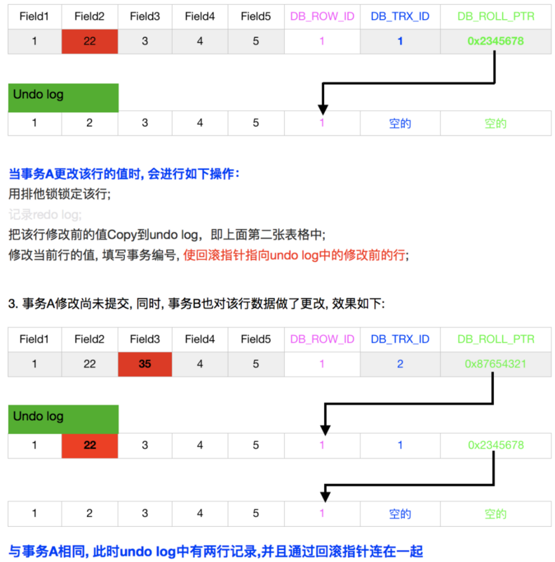

# 数据库篇

## MySQL数据库基础 

### MYSQL中的int(11)到底代表什么意思？

int(0) 显示宽度  11代表的并不是长度，而是字符的显示宽度。当int字段类型设置为**无符号**且**填充零**（UNSIGNED ZEROFILL）时，当数值位数未达到设置的显示宽度时，会在数值前面补充零直到满足设定的显示宽度

```mysql

create table test3 (id int(11) ZEROFILL  not null,id2 int(5) ZEROFILL  ) engine = innodb;

insert into test3 values (10000,500);

select * from test3;
+-------------+--------+
| id          | id2    |
+-------------+--------+
| 00000010000 | 500000 |
| 00000010000 |  00500 |
+-------------+--------+
2 rows in set (0.00 sec)

```

整数类型 、浮点型

| 类型         | 大小                                     | 范围（有符号）                                               | 范围（无符号）                                               | 用途           |
| ------------ | ---------------------------------------- | ------------------------------------------------------------ | ------------------------------------------------------------ | -------------- |
| TINYINT      | 1 字节                                   | (-128，127)                                                  | (0，255)                                                     | 小整数值       |
| SMALLINT     | 2 字节                                   | (-32 768，32 767)                                            | (0，65 535)                                                  | 大整数值       |
| MEDIUMINT    | 3 字节                                   | (-8 388 608，8 388 607)                                      | (0，16 777 215)                                              | 大整数值       |
| INT或INTEGER | 4 字节                                   | (-2 147 483 648，2 147 483 647)                              | (0，4 294 967 295)                                           | 大整数值       |
| BIGINT       | 8 字节                                   | (-9,223,372,036,854,775,808，9 223 372 036 854 775 807)      | (0，18 446 744 073 709 551 615)                              | 极大整数值     |
| FLOAT        | 4 字节                                   | (-3.402 823 466 E+38，-1.175 494 351 E-38)，0，(1.175 494 351 E-38，3.402 823 466 351 E+38) | 0，(1.175 494 351 E-38，3.402 823 466 E+38)                  | 单精度浮点数值 |
| DOUBLE       | 8 字节                                   | (-1.797 693 134 862 315 7 E+308，-2.225 073 858 507 201 4 E-308)，0，(2.225 073 858 507 201 4 E-308，1.797 693 134 862 315 7 E+308) | 0，(2.225 073 858 507 201 4 E-308，1.797 693 134 862 315 7 E+308) | 双精度浮点数值 |
| DECIMAL      | 对DECIMAL(M,D) ，如果M>D，为M+2否则为D+2 | 依赖于M和D的值                                               | 依赖于M和D的值                                               | 小数值         |


### 数据库中varchar和char类型的区别？

char是一种固定长度的类型，varchar则是一种可变长度的类型，

区别是： 　　

char(M)类型的数据列里，每个值都占用M个字节，如果某个长度小于M，MySQL就会在它的右边用空格字符补足．（在检索操作中那些填补出来的空格字符将被去掉）

varchar(M) 会拿出1个或2个字节记录字符串的长度，列长度小于255 使用一个字节标识，否则2个。超过指定长度会截断


应用：

对于经常变更的数据 char比varchar更好，char不容易产生碎片
对于非常短的列 char根据空格填充方便比较，char比varchar在存储空间上更有效率
尽量避免使用text blob 查询会使用临时表，导致严重的性能开销


| 类型       | 大小             | 用途                            |
| ---------- | ---------------- | ------------------------------- |
| CHAR       | 0-255字节        | 定长字符串                      |
| VARCHAR    | 0-65535 字节     | 变长字符串                      |
| TINYBLOB   | 0-255字节        | 不超过 255 个字符的二进制字符串 |
| TINYTEXT   | 0-255字节        | 短文本字符串                    |
| BLOB       | 0-65535字节      | 二进制形式的长文本数据          |
| TEXT       | 0-65535字节      | 长文本数据                      |
| MEDIUMBLOB | 0-16777215字节   | 二进制形式的中等长度文本数据    |
| MEDIUMTEXT | 0-16777215字节   | 中等长度文本数据                |
| LONGBLOB   | 0-4294967295字节 | 二进制形式的极大文本数据        |
| LONGTEXT   | 0-4294967295字节 | 极大文本数据                    |


### 用不用枚举enum字段？为什么？

修改枚举值需要修改表结构。

mysql 5.6 以前修改字段需要锁表。 

https://dev.mysql.com/doc/refman/5.6/en/innodb-online-ddl-operations.html


### 日期和时间类型

尽量使用timestamp ，比datetime 空间效率高

用整数保存时间戳的格式通常不方便处理

如果要保存微秒 使用bigint


| 类型      | 大小 | 范围                                                         | 格式                | 用途                     |
| --------- | ---- | ------------------------------------------------------------ | ------------------- | ------------------------ |
| DATE      | 3    | 1000-01-01/9999-12-31                                        | YYYY-MM-DD          | 日期值                   |
| TIME      | 3    | '-838:59:59'/'838:59:59'                                     | HH:MM:SS            | 时间值或持续时间         |
| YEAR      | 1    | 1901/2155                                                    | YYYY                | 年份值                   |
| DATETIME  | 8    | 1000-01-01 00:00:00/9999-12-31 23:59:59                      | YYYY-MM-DD HH:MM:SS | 混合日期和时间值         |
| TIMESTAMP | 4    | 1970-01-01 00:00:00/2038  结束时间是第 2147483647 秒，北京时间 2038-1-19 11:14:07，格林尼治时间 2038年1月19日 凌晨 03:14:07 | YYYYMMDD HHMMSS     | 混合日期和时间值，时间戳 |


### MYSQL取得当前时间的函数是?，格式化日期的函数是

答:now(),date() date_format()


### delete truncate 区别

truncate 一次删除一页16k    不能删除部分    不可以回滚
​delete  一行一行删除    可以删除部分   可以回滚


truncate 不删除定义、释放空间 、只能删除所有数据、一次删除整个页

delete    不删除定义、不释放空间、可以删部分数据，可以回滚、每行记录日志


### count(*) count(1) count(column) 有什么区别？

1.count(1)与count(*)得到的结果一致，包含null值。
2.count(字段)不计算null值
3.count(null)结果恒为0


### 内连接、外连接

inner join

left join


### 说出你所知道的数据库设计范式？

https://www.zhihu.com/question/24696366

  1NF:符合1NF的关系中的每个属性都不可再分    每一个属性满足原子性，不可以分割；

  2NF:消除了非主属性对于码的部分函数依赖   每一条记录要满足唯一性，

  3NF:3NF在2NF的基础之上，消除了非主属性对于码的传递函数依赖。  字段不冗余，有时我们还需要反三范式，常用的建模工具：phpMyAdmin,navicat for mysql,DOS命令行；


### 如何防止SQL注入？

1、参数绑定

2、检查变量的数据类型和格式

3、所有sql语句都封装在存储过程中


### 理解Mysql prepare预处理语句

1、prepare语句使用占位符(?)，这有助于避免SQL注入的问题，从而使您的应用程序更安全一些。1

2、节省硬解析的时间 约占sql查询的8%

SQL执行过程包括以下阶段 词法分析->语法分析->语义分析->执行计划优化->执行。词法分析->语法分析这两个阶段我们称之为硬解析。对于只是参数不同，其他均相同的sql，它们执行时间不同但硬解析的时间是相同的。而同一SQL随着查询数据的变化，多次查询执行时间可能不同，但硬解析的时间是不变的。

https://www.cnblogs.com/justfortaste/p/3920140.html


### Mysql 设计规范-------------------------------

<https://mp.weixin.qq.com/s/1XyUXcB12GGJXJ_hWxIx_Q>


## MySQL版本类问题

### 为什么选择哪个分支的mysql


| Oracle MySQL                       | Percona MySQL        | MariaDB           |
| ---------------------------------- | -------------------- | ----------------- |
| 企业版有监控工具<br />社区版不提供 | percona monitor 工具 | monyog            |
| Innodb                             | XtraDB               | XtraDB            |
| MGR                                | MGR & PXC            | Galera Cluster    |
|                                    | ProxySql FireWall    | MaxScale FireWall |
|                                    | 审计日志             |                   |
| 窗口函数（8.0）                    | 窗口函数             | 窗口函数          |
|                                    |                      | 支持基于日志回滚  |


### MySQL5.5  5.6 5.7 8区别


CPU的利用特点

<5.1 多核心支持较弱

5.1 可以利用4个核

5.5 可以利用24个核

5.6 支持64个核

一个连接对应一个线程，每个并发的query 只能用到一个核  没有thread_pool


内存的利用特点

内存管理简单  buffer 

querycache 鸡肋？为什么鸡肋？对大小写敏感 ，顺序不一致也会失效，任何的写操作都会失效

磁盘随机IO  


对磁盘的利用特点

undo log 顺序写 随机读

redo log  顺序写 顺序读

数据文件的IO特征，随机写随机读。OLTP业务以随机IO为主，建议加大内存，尽量合并随机IO为顺序IO

OLAP业务以顺序IO为主，极大的内存同时增加硬盘数量提高顺序IO性能

Innodb是索引组织表，myisam是堆组织表

innodb相比myisam更消耗磁盘空间


#### MySQL5.6新特性

MySQL5.6.24上InnoDB引擎也加入了全文索引


#### MySQL5.7新特性

组提交和并行复制 
	5.6支持以scheme为维度的并行复制 

​	可以发现较之原来的二进制日志内容多了last_committed和sequence_number，last_committed表示事务提交的时候，上次事务提交的编号，如果事务具有相同的last_committed，表示这些事务都在一组内，可以进行并行的回放。

GIS空间索引
全文索引  xunsearch  opensearch solr elasticsearch
JSON支持
安全性


#### MySQL8新特性

增加了角色管理、用户创建和授权分开

增加了降序索引 函数索引 增加了隐藏索引的功能

增加了隐藏索引

增加了CTE递归处理

增加了窗口函数 over 

增强了InnoDB

增强了JSON支持 JSON合并函数  JSON合并函数

文档模式

使用utf8mb4 作为默认字符集


所有元数据使用innodb硬气存储，无frm文件

使用innodb独立表空间

Innodb DDL语句支持原子操作

支持在线修改uno表空间

新增管理视图用于监控innodb表状态

支持定义资源管理组（目前仅支持CPU）

​	\h create resource group 

由于Resource Group特性的引入，我们可以来通过资源组的方式修改线程的优先级以及所能使用的资源，可以指定不同的线程使用特定的资源。


支持直方图

在线修改全局参数并持久化


## MySQL的缺点

无share pool， 每个SQL都需要解析，但可利用Query Cache提高效率
不支持CBO（目前只有RBO）
每个SQL只能使用到一个核
随着连接数的增加性能下降严重（但Thread Pool拯救了世界）
MySQL 5.6后对子查询进一步优化（之前的版本太挫了）
暂无hash join特性（MariaDB对此做了优化）
不要让MySQL跑复杂应用（BI、 复杂关联、复杂子查询等，这不是强项

## MySQL引擎相关


### MySQL常用的存储引擎

| 引擎名称 | 是否支持事务 | 说明                                                         |
| -------- | ------------ | ------------------------------------------------------------ |
| MYISAM   | N            | MySQL5.6之前的默认引擎，最常用的非事务型存储引擎  <br />堆表方式存储  表锁 btree 空间索引 全文索引 |
| CSV      | N            | 以CSV格式存储的非事务型存储引擎<br />所有列都不能为null 不支持索引 <br />作为中间表 同步数据 |
| Archive  | N            | 只允许查询和新增数据 不允许修改的非事务型存储引擎<br />使用zlib压缩 适合日志型的数据   参考tokudb |
| Memory   | N            | 数据易丢失的非事务存储引擎<br />数据保存在内存中  所有字段固定长度  不支持text 支持btree和hash索引 |
| Innodb   | Y            | 最常用的事务型存储引擎 ACID<br />主键聚集存储 支持行级锁 MVCC |
| NDB      | Y            | MySQL集群所使用的的内存型事务存储引擎<br />数据存储在内存中  行级锁  支持高可用集群 |


### MySQL存储引擎MyISAM与InnoDB的区别？


一、InnoDB支持事务，MyISAM不支持，这一点是非常之重要。事务是一种高级的处理方式，如在一些列增删改中只要哪个出错还可以回滚还原，而MyISAM就不可以了。InnoDB 给 MySQL 提供了具有事务(commit)、回滚(rollback)和崩溃修复能力(crash recovery capabilities)的事务安全(transaction-safe (ACID compliant))型表。MyISAM避免事务型额外的开销

二、MyISAM适合查询以及插入为主的应用，InnoDB适合频繁修改以及设计到安全性就高的应用

三、InnoDB支持外键，MyISAM不支持

四、5.6开始 InnoDB是默认引擎，MyISAM是5.6以前的默认存储引擎

五、5.6开始 InnoDB支持FULLTEXT类型的索引

六、InnoDB中不保存表的行数，如select count(*) from table时，InnoDB需要扫描一遍整个表来计算有多少行，但是MyISAM只要简单的读出保存好的行数即可。注意的是，当count(*)语句包含where条件时MyISAM也需要扫描整个表

七、对于自增长的字段，InnoDB中必须包含只有该字段的索引，但是在MyISAM表中可以和其他字段一起建立联合索引

八、清空整个表时，InnoDB是一行一行的删除，效率非常慢。MyISAM则会重建表

九、InnoDB支持行锁（某些情况下还是锁整表，如 update table set a=1 where user like '%lee%'，MyISAM 不会出现死锁 

十、InnoDB经过优化，性能会比MyISAM更好一些

MyISAM的索引和数据是分开的，并且索引是有压缩的，内存使用率就对应提高了不少。能加载更多索引，而Innodb是索引和数据是紧密捆绑的，没有使用压缩从而会造成Innodb比MyISAM体积庞大不小。

十一、LOAD TABLE FROMMASTER操作对InnoDB是不起作用的，解决方法是首先把InnoDB表改成MyISAM表，导入数据后再改成InnoDB表，但是对于使用的额外的InnoDB特性(例如外键)的表不适用。

十二、MyISAM是文件存储的，可以进行直接在不同操作系统间拷贝使用


一般来说，MyISAM适合：

(1)做很多count 的计算；

(2)插入不频繁，查询非常频繁；

(3)没有事务。

(4)MYISAM适合小数据，小并发

InnoDB适合：

(1)可靠性要求比较高，或者要求事务,适合大数据，大并发；

(2)表更新和查询都相当的频繁


### 什么情况下Innodb无法在线修改表结构？

MySQL 5.5以前修改表结构会锁表

5.6 online ddl推出以前，执行ddl主要有两种方式copy方式和inplace方式，inplace方式又称为(fast index creation)。相对于copy方式，inplace方式不拷贝数据，因此较快。但是这种方式仅支持添加、删除索引两种方式，而且与copy方式一样需要全程锁表，实用性不是很强。


MySQL5.6 online ddl 

加全文索引 导致锁表 

删除主键

修改列类型

指定字符集 、 转换字符集


https://blog.csdn.net/qq_42606051/article/details/82148173

https://dev.mysql.com/doc/refman/5.7/en/innodb-online-ddl-operations.html


## 索引

### 什么是索引？

索引是帮助MySQL高效获取数据的数据结构。


### 索引的使用场景？

对于非常小的表，全表扫描效率更高

数据量几十万，百万级别 索引非常有效

千万级别的表建立和使用索引的代价将随之增长，可以使用分库分表


### 索引有哪些？

按功能分

主键索引  一个表只有一个主键

唯一索引  一个表可以有多个唯一索引 

普通索引

全文索引


聚集索引   InnoDB    数据的物理存储顺序是否和索引顺序一致

非聚集索引  myisam


组合索引  

单值索引


### 索引的优势劣势？

创建索引可以大大提高系统的性能。

索引的优点

　　1.创建唯一性索引，保证数据库表中每一行数据的唯一性

　　2.大大加快数据的检索速度，这也是创建索引的最主要的原因

　　3.加速表和表之间的连接，特别是在实现数据的参考完整性方面特别有意义。

　　4.在使用分组和排序子句进行数据检索时，同样可以显著减少查询中分组和排序的时间。

　　5.通过使用索引，可以在查询的过程中使用优化隐藏器，提高系统的性能。

索引的缺点

　　1.创建索引和维护索引要耗费时间，这种时间随着数据量的增加而增加

　　2.索引需要占物理空间，除了数据表占数据空间之外，每一个索引还要占一定的物理空间，如果要建立聚簇索引，那么需要的空间就会更大

　　3.当对表中的数据进行增加、删除和修改的时候，索引也要动态的维护，降低了数据的维护速度


### 哈希索引的优势：

1、等值查询。哈希索引具有绝对优势（前提是：没有大量重复键值，如果大量重复键值时，哈希索引的效率很低，因为存在所谓的哈希碰撞问题。）

五、哈希索引不适用的场景：

1、不支持范围查询

2、不支持索引完成排序

3、不支持联合索引的最左前缀匹配规则


### 什么时候不需要建索引?

1、表记录很少

2、经常增删改查的表

3、数据重复且分布平均的表字段，性别，年龄等


### 索引失效的几种情况?

少用 OR

有大量的IN

like查询是以%开头  的select *

使用!=  <>

如果列类型是字符串，那一定要在条件中将数据使用引号引用起来,否则不使用索引 导致隐式转换

对于联合索引，不是使用的第一部分(第一个)，则不会使用索引

​	中间索引字段也不能省略

​	范围之后全部失效

is null  is not null 也无法使用索引

如果mysql估计使用全表扫描要比使用索引快,则不使用索引，查询的数量是大表的大部分，应该是30％以上。

查询条件使用函数在索引列上，或者对索引列进行运算


### like %% 查询索引失效问题与解决办法---------------------

使用前置匹配

全文索引

其他的全文搜索引擎 es  solr Lucene

oracle 使用翻转函数+like前模糊查询+建立翻转函数索引=走翻转函数索引，不走全扫描。（mysql不支持）


### 不同编码下Varchar实际存储最大多少

not null 的情况下 65533 


### MySQL 排序内部原理是什么？

https://juejin.im/entry/59019b428d6d810058b8488e

https://zhuanlan.zhihu.com/p/24410681


explain 看查询  无法看排序

group by之前必排序


### 什么叫覆盖索引？

select的数据列只用从索引中就能够取得，不必从数据表中读取

https://blog.csdn.net/alex_xfboy/article/details/82789942


### 索引是如何实现的？

​	B+树实现  平衡树  
​	非叶子节点存储 多个 索引值、和页指针
​	叶子节点 存储数据 和所有值
​	聚集索引、非聚集索引 数据存储的顺序是否和索引存储的顺序一致


### 为什么索引结构默认使用B-Tree，而不是B树、hash，二叉树，红黑树？

hash：虽然可以快速定位，但是没有顺序，IO复杂度高，解决不了范围查询。

二叉树：树的高度不均匀，不能自平衡，查找效率跟数据有关（树的高度），并且IO代价高。

B-树和B+树最重要的一个区别就是B+树只有叶节点存放数据，其余节点用来索引，冗余一份索引便于搜索。而B-树是每个索引节点都会有Data域。根据计算机局部原理，一次io可以查询更多的行数

红黑树：树的高度随着数据量增加而增加，IO代价高。


索引底层存储图B+树图示


参考：https://www.cnblogs.com/liqiangchn/p/9060521.html


### 局部性原理与磁盘预读

局部性原理：当一个数据被用到时，其附近的数据也通常会马上被使用。程序运行期间所需要的数据通常比较集中。由于磁盘顺序读取的效率很高（不需要寻道时间，只需很少的旋转时间），因此对于具有局部性的程序来说，预读可以提高I/O效率。

预读的长度一般为页（page）的整倍数。页是计算机管理存储器的逻辑块，硬件及操作系统往往将主存和磁盘存储区分割为连续的大小相等的块，每个存储块称为一页（在许多操作系统中，页得大小通常为4k），主存和磁盘以页为单位交换数据


### MyIsam索引底层实现图示

MyIsam主键索引


MyISAM非主键索引


### Innodb索引底层实现图示

innodb主键索引


innodb非主键索引


### 联合索引内部的存储原理--------------------------


### MySQL 复合索引注意事项

多字段检索适合复合索引 联合索引

1、最左原则  使用第二个索引，必须使用第一个.复合索引，一般遵循最左前缀原则，如table_a 的 a b c 三列建复合索引 

create index ind_table_a on table_a(a,b,c);那么，只有在条件中用到a,或者a、b,或者a、b、c,或者a c这样的情况下，才会用到刚建的复合索引。

2、如果where条件中有or 不起作用

3、值最少的字段安放在键的左边

4、尽量减少索引的字段，字段太多会降低写速度


## Mysql性能优化

<https://mp.weixin.qq.com/s/BQLfq3fUiTEHxzA5Y41l_A>


### 优化sql explain 执行计划----------------------

explain

https://dev.mysql.com/doc/refman/5.7/en/explain-output.html

|               |      |                                                              |
| ------------- | ---- | ------------------------------------------------------------ |
| id            |      | id相同   自上而下 顺序执行<br />id不同  id值越大，越先执行  derived |
| select_type   |      |                                                              |
| table         |      |                                                              |
| type          |      |                                                              |
| possible_keys |      |                                                              |
| key           |      |                                                              |
| key_len       |      |                                                              |
| ref           |      |                                                              |
| filtered      |      |                                                              |
| Extra         |      |                                                              |


| `select_type` Value                                          | JSON Name                    | Meaning                                                      |
| ------------------------------------------------------------ | ---------------------------- | ------------------------------------------------------------ |
| `SIMPLE`                                                     | None                         | Simple [`SELECT`](https://dev.mysql.com/doc/refman/5.7/en/select.html) (not using [`UNION`](https://dev.mysql.com/doc/refman/5.7/en/union.html) or subqueries) |
| `PRIMARY`                                                    | None                         | Outermost [`SELECT`](https://dev.mysql.com/doc/refman/5.7/en/select.html) |
| [`UNION`](https://dev.mysql.com/doc/refman/5.7/en/union.html) | None                         | Second or later [`SELECT`](https://dev.mysql.com/doc/refman/5.7/en/select.html) statement in a [`UNION`](https://dev.mysql.com/doc/refman/5.7/en/union.html) |
| `DEPENDENT UNION`                                            | `dependent` (`true`)         | Second or later [`SELECT`](https://dev.mysql.com/doc/refman/5.7/en/select.html) statement in a [`UNION`](https://dev.mysql.com/doc/refman/5.7/en/union.html), dependent on outer query |
| `UNION RESULT`                                               | `union_result`               | Result of a [`UNION`](https://dev.mysql.com/doc/refman/5.7/en/union.html). |
| [`SUBQUERY`](https://dev.mysql.com/doc/refman/5.7/en/optimizer-hints.html#optimizer-hints-subquery) | None                         | First [`SELECT`](https://dev.mysql.com/doc/refman/5.7/en/select.html) in subquery |
| `DEPENDENT SUBQUERY`                                         | `dependent` (`true`)         | First [`SELECT`](https://dev.mysql.com/doc/refman/5.7/en/select.html) in subquery, dependent on outer query |
| `DERIVED`                                                    | None                         | Derived table                                                |
| `MATERIALIZED`                                               | `materialized_from_subquery` | Materialized subquery                                        |
| `UNCACHEABLE SUBQUERY`                                       | `cacheable` (`false`)        | A subquery for which the result cannot be cached and must be re-evaluated for each row of the outer query |
| `UNCACHEABLE UNION`                                          | `cacheable` (`false`)        | The second or later select in a [`UNION`](https://dev.mysql.com/doc/refman/5.7/en/union.html) that belongs to an uncacheable subquery (see`UNCACHEABLE SUBQUERY`) |


show profile


### ORDER BY和GROUP BY  优化------------------------

http://blog.sina.com.cn/s/blog_a1e9c7910102x1bz.html


### join优化

小表驱动大表

for(int i=0;i < 5;i++){	

​	for(int j=0;j < 1000;j++){	

}

for(int i=0;i < 1000;i++){	

​	for(int j=0;j < 5;j++){	

}


### 高效sql性能优化极简教程

<https://mp.weixin.qq.com/s/Sqp-gD7mh1luXancnzE2Nw>

1，选择最有效率的表连接顺序


首先要明白一点就是SQL 的语法顺序和执行顺序是不一致的

SQL的语法顺序：

   select   【distinct】 ....from ....【xxx  join】【on】....where....group by ....having....【union】....order by......

SQL的执行顺序：

   from ....【xxx  join】【on】....where....group by ....avg()、sum()....having....select   【distinct】....order by......

from 子句--执行顺序为从后往前、从右到左
表名(最后面的那个表名为驱动表，执行顺序为从后往前, 所以数据量较少的表尽量放后）

where子句--执行顺序为自下而上、从右到左

将可以过滤掉大量数据的条件写在where的子句的末尾性能最优

group by 和order by 子句执行顺序都为从左到右

select子句--少用*号，尽量取字段名称。 使用列名意味着将减少消耗时间。


2，避免产生笛卡尔积

3，避免使用*

4，用where子句替换having子句

where子句搜索条件在进行分组操作之前应用；而having自己条件在进行分组操作之后应用。避免使用having子句，having子句只会在检索出所有纪录之后才对结果集进行过滤，这个处理需要排序，总计等操作。如果能通过where子句限制记录的数目，那就能减少这方面的开销。


5，用exists、not exists和in、not in相互替代


原则是哪个的子查询产生的结果集小，就选哪个

select * from t1 where x in (select y from t2)

select * from t1 where exists (select null from t2 where y =x)

IN适合于外表大而内表小的情况；exists适合于外表小而内表大的情况


6，使用exists替代distinct


当提交一个包含一对多表信息（比如部门表和雇员表）的查询时，避免在select子句中使用distinct，一般可以考虑使用exists代替，exists使查询更为迅速，因为子查询的条件一旦满足，立马返回结果。

低效写法：

select distinct dept_no,dept_name from dept d,emp e where d.dept_no=e.dept_no

高效写法：

select dept_no,dept_name from dept d where  exists (select 'x' from emp e where e.dept_no=d.dept_no)

备注：其中x的意思是：因为exists只是看子查询是否有结果返回，而不关心返回的什么内容，因此建议写一个常量，性能较高！

用exists的确可以替代distinct，不过以上方案仅适用dept_no为唯一主键的情况，如果要去掉重复记录，需要参照以下写法：

select * from emp  where dept_no exists (select Max(dept_no)) from dept d, emp e where e.dept_no=d.dept_no group by d.dept_no)


7，避免隐式数据类型转换


8，使用索引来避免排序操作


在执行频度高，又含有排序操作的sql语句，建议适用索引来避免排序。排序是一种昂贵的操作，在一秒钟执行成千上万次的sql语句中，如果带有排序操作，往往会消耗大量的系统资源，性能低下。索引是一种有序结果，如果order by后面的字段上建有索引，将会大大提升效率！


9，尽量使用前端匹配的模糊查询

10，不要在选择性较低的字段建立索引

11，避免对列的操作，不要在where条件中对字段进行数学表达式运算

12，尽量去掉"IN","OR"


含有"IN"、"OR"的where子句常会使用工作表，使索引失效，如果不产生大量重复值，可以考虑把子句拆开；拆开的子句中应该包含索引；

select count(*) from stuff where id_no in('0','1')

可以拆开为：

select count(*) from stuff where id_no='0'

select count(*) from stuff where id_no='1'

然后在做一个简单的加法


13,尽量去掉"<>"


尽量去掉"<>"，避免全表扫描，如果数据是枚举值，且取值范围固定，可以使用"or"方式

update serviceinfo set state=0 where state<>0;

以上语句由于其中包含了"<>"，执行计划中用了全表扫描（Table access full），没有用到state字段上的索引，实际应用中，由于业务逻辑的限制，字段state智能是枚举值，例如0,1或2，因此可以去掉"<>" 利用索引来提高效率。

update serviceinfo set state=0 where state =1 or state =2


14,避免在索引列上使用IS NULL或者NOT


避免在索引中使用任何可以为空的列，导致无法使用索引


15，批量提交sql


如果你需要在一个在线的网站上去执行一个大的DELETE或INSERT查询，你需要非常小心，要避免你的操作让你的整个网站停止相应。因为这两个操作是会锁表的，表一锁住了，别的操作都进不来了。

Apache会有很多的子进程或线程。所以，其工作起来相当有效率，而我们的服务器也不希望有太多的子进程，线程和数据库链接，这是极大的占服务器资源的事情，尤其是内存。

如果你把你的表锁上一段时间，比如30秒钟，那么对于一个有很高访问量的站点来说，这30秒所积累的访问进程或线程，数据库链接，打开的文件数，可能不仅仅会让你的WEB服务崩溃，还可能会让你的整台服务器马上挂了。所以，如果你有一个大的处理，你一定把其拆分。


### 优化查询的方法

#### 1、使用索引

#### 2、优化SQL语句

2.1、使用explain查看执行计划

2.2、不要使用select *,尽量指定列

2.3、不在索引上面使用函数

2.4、查询使用limit


#### 3、优化数据库对象

3.1 优化表的数据类型

select * from table procedure analyse(enum_limit,max_memory);

字段能小就小，减少对磁盘空间、内存、cpu缓存的使用


3.2对表进行拆分

3.2.1、垂直拆分

将主键和一部分列放一张表，再把主键和一些不常用的列放一张表


3.2.2、水平拆分

根据某个字段的某种规则分散到多个数据库


3.3使用中间表提高查询速度


#### 4、硬件优化

4.1、CPU的优化：使用多核和主频高的CPU

4.2、内存的优化 使用更大的内存，将尽量多的内存分配给MYSQL做缓存

4.3、磁盘IO的优化

4.3.1、使用磁盘阵列 RAID1+0

4.3.2、调整磁盘调度算法

4.3.3、 系统级别的优化  
	使用新的文件系统xfs centos7已经默认xfs centos6默认是ext4 
	内核相关参数优化


#### 5、MySQL自身的优化

主要是my.cnf的参数优化调整。指定MySQL查询缓冲区的大小，指定最大连接进程数

独立表空间


#### 6、应用的优化

6.1、使用数据库连接池

6.2、使用查询缓存


### MySQL的优化原则------------------------------

#### 表设计规范

​	尽可能使用innodb

​	InnoDB必须设置自增主键

​	尽可能选择小的数据类型和指定短的长度

​	尽量使用整型或枚举 表示字符串 

​	尽量not null

#### 索引规范

#### SQL规范

​	SELECT子句中避免使用‘*’

​	避免在索引列上使用计算

​	减少子查询等 尽量不适用子查询，使用join

<https://juejin.im/post/5c6b9c09f265da2d8a55a855>


### 如果有一个特别大的访问量到数据库上，怎么做优化？MySQL 对于千万级的大表要怎么优化？

1、使用优化查询的方法 优化表字段、索引、sql

2、加缓存 memcached,redis

3、读写分离  主从复制、读写分离、负载均衡

4、数据库分表、分区、分库

5、垂直拆分 一个业务分成多个业务

6、水平拆分  一张表按时间维度 按用户维度拆分


## 事务-----------------------------------------


### 数据库中的事务是什么？

答:事务（transaction）是作为一个单元的一组有序的数据库操作。如果组中的所有操作都成功，则认为事务成功，即使只有一个操作失败，事务也不成功。如果所有操作完成， 事务则提交，其修改将作用于所有其他数据库进程。如果一个操作失败，则事务将回滚，该事务所有操作的影响都将取消。 答：事务就是一系列的操作,这些操作完成一项任务。只要这些操作里有一个操作没有成功,事务就操作失败,发生回滚事件。即撤消前面的操作,这样可以保证数据的一致性。而且可以把操作暂时放在缓存里,等所有操作都成功有提交数据库,这样保证费时的操作都是有效操作。


### 数据库事务的四个基本要素：ACID

|        |                                                    |                                     |
| ------ | -------------------------------------------------- | ----------------------------------- |
| 原子性 |                                                    | undo log 记录修改前的状态           |
| 一致性 | 事务开始之前和事务结束以后，数据的完整性没有被破坏 | redo log  记录修改后的状态          |
| 隔离性 | 并发控制  每个事务提交前对其他事务不可见           | 锁 共享锁 排它锁                    |
| 持久性 | 事务提交后，永久性保存结果                         | 重做日志redo log  回滚日志 undo log |


### INNODB是如何实现事务？

数据库的隔离性是由锁实现的，事务则是由数据库的redo log和undo log实现的。

1.redo
redo log，重做日志，用来保证事务的原子性和持久性


2.undo
undo log，回滚日志，用来保证事务的一致性。


3.purge
这个purge过程会在master主线程中或者某些特定条件下进行，收复一些无用的undo页。


4.mvvc 多版本并发机制

MVCC只在 READ COMMITTED 和 REPEATABLE READ 两个隔离级别下工作。其他两个隔离级别够和MVCC不兼容, 因为 READ UNCOMMITTED 总是读取最新的数据行, 而不是符合当前事务版本的数据行。而 SERIALIZABLE 则会对所有读取的行都加锁。


#### MySQL如何实现可重复读？

innodb是通过在行末尾加入3个字段
6字节的DATA_TRX_ID ， 表示哪个事务修改
7字节的DATA_ROLL_PTR 指向当前记录项的rollback segment的undo log记录
6字节的DB_ROW_ID， 记录行的事务的开始修改时间或者删除时间
1字节的DELETE BIT， 用于标识该记录是否被删除
在共享读的时候，事务也会记录一个开始时间DB_ROW_ID，通过对比时间的顺序来计算得到事务开始的时候的行数据，从而达到共享读的效果。


事务对某行记录的更新过程是怎么样的？

1、对 DB_ROW_ID = 1 的这行记录加排他锁

2、把该行原本的值拷贝到 undo log 中，DB_TRX_ID 和 DB_ROLL_PTR 都不动

3、修改该行的值这时产生一个新版本，更新 DATA_TRX_ID 为修改记录的事务 ID，将 DATA_ROLL_PTR 指向刚刚拷贝到 undo log 链中的旧版本记录，这样就能通过 DB_ROLL_PTR 找到这条记录的历史版本。如果对同一行记录执行连续的 UPDATE，Undo Log 会组成一个链表，遍历这个链表可以看到这条记录的变迁

4、记录 redo log，包括 undo log 中的修改


那么 INSERT 和 DELETE 会怎么做呢？
其实相比 UPDATE 这二者很简单，INSERT 会产生一条新纪录，它的 DATA_TRX_ID 为当前插入记录的事务 ID；DELETE 某条记录时可看成是一种特殊的 UPDATE，其实是软删，真正执行删除操作会在 commit 时，DATA_TRX_ID 则记录下删除该记录的事务 ID。




参考:https://blog.csdn.net/culminate_in/article/details/69525177


### 并发事务带来的问题

​	更新丢失
​	脏读
​	不可重复读
​	幻读


### 事务的4个隔离级别

|          |                                                           | 脏读 | 幻读 | 不可重复读 |
| -------- | --------------------------------------------------------- | ---- | ---- | ---------- |
| 读未提交 | 一个事务可以读取另一个未提交事务的数据。                  | X    | X    | X          |
| 读已提交 | 一个事务要等另一个事务提交后才能读取数据。oracle 默认级别 |      | X    | X          |
| 可重复读 | 一个事务内的查询都是事务开始时刻一致的，InnoDB默认级别。  |      |      | X          |
| 串行化   | 事务串行化顺序执行                                        |      |      |            |

​	

参考：https://www.cnblogs.com/zhoujinyi/p/3437475.html


### 为什么mysql选可重复读作为默认的隔离级别？

MySQL使用可重复读来作为默认隔离级别的主要原因是语句级的Binlog。RR能提供SQL语句的写可串行化，保证了绝大部分情况（不安全语句除外）的DB/binlog 日志一致。

2个update 直接有一个delete的情况 会对binlog结果产生影响。


读已提交

不用解决，这个问题是可以接受的！毕竟你数据都已经提交了，读出来本身就没有太大问题！

参考：

https://blog.csdn.net/shudaqi2010/article/details/79958222


### 什么是队列？排它锁，Myisam 死锁如何解决？

  答：在默认情况下Myisam是表级锁，所以同时操作单张表的多个动作只能以队列的方式进行；

排它锁又名写锁，在SQL执行过程中为排除其它请求而写锁，在执行完毕后会自动释放；

死锁解决：先找到死锁的线程号，然后杀掉线程ID


```shell
pt-deadlock-logger 

set global innodb_print_all_deadlocks=on;
```


### 设计锁的问题--------------------------------------

锁是计算机协调多进程或多线程并发访问某一资源的机制


共享锁：允许多个事务加锁一个共享页

排他锁：只能有一个事务加锁一个共享页 

### 

表级锁（锁定整个表）

页级锁（锁定一页）


容易死锁


MySQL锁的粒度

MyIsam 最小粒度：表级锁

InnoDB 最小粒度：行级锁  发生锁冲突的概率最低

页级锁

写锁优先、


悲观锁  从数据刚开始更改时就将数据锁住，知道更改完成才释放。

select * from table where id = 1 for update;

加锁的时机很长，并发性不好


乐观锁   准备提交修改到数据库的时候才将数据锁住

实现方式：加version

使用时间戳


### 死锁产生的条件，预防死锁？--------

假设 T1 和 T2 同时达到 select，T1 对 table 加共享锁，T2 也对 table 加共享锁，当 T1 的 select 执行完，准备执行 update 时，根据锁机制，T1 的共享锁需要升级到排他锁才能执行接下来的 update.在升级排他锁前，必须等 table 上的其它共享锁（T2）释放，同理，T2 也在等 T1 的共享锁释放。于是死锁产生了。


破坏“不可剥夺”条件：一个进程不能获得所需要的全部资源时便处于等待状态，等待期间他占有的资源将被隐式的释放重新加入到 系统的资源列表中，可以被其他的进程使用，而等待的进程只有重新获得自己原有的资源以及新申请的资源才可以重新启动，执行。
破坏”请求与保持条件“：第一种方法静态分配即每个进程在开始执行时就申请他所需要的全部资源。第二种是动态分配即每个进程在申请所需要的资源时他本身不占用系统资源。
破坏“循环等待”条件：采用资源有序分配其基本思想是将系统中的所有资源顺序编号，将紧缺的，稀少的采用较大的编号，在申请资源时必须按照编号的顺序进行，一个进程只有获得较小编号的进程才能申请较大编号的进程。


### CAP原理 

 一致性 伸缩性  分布性  三个只能满足2个


### 分布式事务 

2PC协议  
	预处理 -> prepare -> commit

队列事务

TCC编程模式


## 其他问题


### 连接池的优点

数据库连接池技术带来的优势：

1． 资源重用

由于数据库连接得到重用，避免了频繁创建、释放连接引起的大量性能开销。在减少系统消耗的基础上，另一方面也增进了系统运行环境的平稳性（减少内存碎片以及数据库临时进程/线程的数量）。

2． 更快的系统响应速度

数据库连接池在初始化过程中，往往已经创建了若干数据库连接置于池中备用。此时连接的初始化工作均已完成。对于业务请求处理而言，直接利用现有可用连接，避免了数据库连接初始化和释放过程的时间开销，从而缩减了系统整体响应时间。

3． 新的资源分配手段

对于多应用共享同一数据库的系统而言，可在应用层通过数据库连接的配置，实现数据库连接池技术，几年钱也许还是个新鲜话题，对于目前的业务系统而言，如果设计中还没有考虑到连接池的应用，那么…….快在设计文档中加上这部分的内容吧。某一应用最大可用数据库连接数的限制，避免某一应用独占所有数据库资源。

4． 统一的连接管理，避免数据库连接泄漏

在较为完备的数据库连接池实现中，可根据预先的连接占用超时设定，强制收回被占用连接。从而避免了常规数据库连接操作中可能出现的资源泄漏。一个最小化的数据库连接池实现：


### 自增主键ID重复的问题？

InnoDB会将最大id记录在内存里，重启后会丢失。

mysqld 重启后采用执行类似select max(id)+1 from t1;方法来得到AUTO_INCREMENT。

myisam记录自增主键ID

mysql8新增了自增ID持久化的功能


### @是用户变量，@@是系统变量


### 存储过程的优缺点

优点

​		1、存储过程的sql已经预编译过了，运行速度较快
​		2、存储过程在服务端执行，减少客户端的压力
​		3、可以把复杂的sql流程封装  简化操作
​		4、减少网络流量
​		5、增加使用的安全性

缺点
	调试麻烦。


### MySQL触发器是

可以通过数据库中的相关表实现级联更改

实时监控某张表中的某个字段的更改而需要做出相应的处理

某些业务编号的生成等

滥用导致数据库及应用程序的维护困难


BEFORE insert update delete

AFTER  insert update delete

尽量避免使用


### 连接数过高too many connections的解决办法

gdb -p $(cat /root/sandboxes/msb_5_6_19/data/mysql_sandbox5619.pid) -ex "set max_connections=500" -batch  

<http://www.cnblogs.com/gomysql/p/3834797.html>


## MySQL底层实现


### MySQL的底层是如何实现的？


分4层：连接层、服务层、引擎层、存储层


Connectors：不同语言中与 SQL 的交互


Connection Pool：连接池

进行身份验证、线程重用，连接限制，检查内存，数据缓存；管理用户的连接，线程处理等需要缓存的需求。


Management Serveices & Utilities：系统管理和控制工具

备份和恢复的安全性，复制，集群，管理，配置，迁移和元数据。


SQL Interface：SQL 接口

进行 DML、DDL，存储过程、视图、触发器等操作和管理；用户通过 SQL 命令来查询所需结果。


Parser：解析器

查询翻译对象的特权；SQL 命令传递到解析器的时候会被解析器验证和解析。


Optimizer：查询优化器在 MySQL 优化语句过程中，可以通过设置 optimize_switch 控制优化行为。在生产环境上，某时间段 MySQL 服务器压力特别大，load 一度达到了 100，查询发现数据库中有大量的 sql 语句 state 状态 result sorting ，result sorting 这种排序特别消耗 cpu 和内存资源。抽取其中的一条 sql 查看执行计划。


Cache 和 Buffer：查询缓存

全局和引擎特定的缓存和缓冲区；


Engine：存储引擎

show engines;


### 数据库的查询原理

​	MySQL客户端/服务端通信协议是“半双工”的

​	1.客户端发送一条查询给服务器。 
​	2.服务器先检查查询缓存，缓存是一个引用表，如果命中了缓存，则立刻返回存储在缓存中的结果。否则进入下一阶段。 如果查询有自定义函数、存储函数、用户变量，就不再使用缓存。密集型的应用不要打开缓存。
​	3。服务器端进行SQL语法解析，预处理
​	4、再由优化器生成对应的执行计划 
​	4。查询执行引擎，MySql根据优化器生成的执行计划，调用存储引擎的API执行查询。 
​	5。返回结果给客户端。


buffer是写缓存，cache是读缓存。

 


### SQL执行顺序

​	

先从from开始


### 如何做好并发时数据库的数据可靠性 

设置每次事务都写硬盘

innodb_flush_log_at_trx_commit = 1
sync_binlog = 1

主从复制 至少是半同步复制

可以采用pt-table-checksum 和 pt-table-sync 工具来进行数据的校验和修复。

## MySQL运维相关


### MySQL 之status和variables区别

status是状态是系统的状态不可更改，是系统现在的运行状态参数

show variables    查看系统参数，系统默认设置或者dba调整优化后的参数，静态的。可以通过set或者修改my.cnf配置文件修改。


### pt-online-scheme-change原理

1、先创建一个跟原表一样结构的表

2、在新表中改表结构

3、在原表中增加3个触发器，增删改触发器。insert 改为replace update也转为replace

4、分批拷贝原表数据到临时表中

5、rename原表到old表，把新表为原表。rename过程中会导致写入、读取阻塞。

osc问题：

<http://seanlook.com/2016/05/27/mysql-pt-online-schema-change/>

<http://www.sohu.com/a/237564974_505857>


### 在什么情况下INNODB无法修改表结构？

加全文索引
加空间索引
删除主键
增加自增列
类型修改  varchar 转 int
修改字符集


### 在线ddl存在的问题？

​	有部分语句不支持在线DDL

​	长时间的DDL操作会引起严重的主从延迟

​	无法对DDL操作进行资源限制


### 在线修改表结构 OSC 

​	pt-osc
​	1、先创建一个跟原表一样结构的表
​	2、在新表中改表结构
​	3、在原表中增加3个触发器，增删改触发器。insert 改为replace update也转为replace
​	4、分批拷贝原表数据到临时表中
​	5、rename原表到old表，把新表为原表。rename过程中会导致写入、读取阻塞。
​	osc问题：
​	http://seanlook.com/2016/05/27/mysql-pt-online-schema-change/
​	http://www.sohu.com/a/237564974_505857


### 如何对MySQL进行升级？

升级前考虑什么？

​	1、升级给业务带来什么好处？

​			是否能解决业务上某一方面的痛点？

​				升级mysql5.7  并行复制

​				使用json类型

​			是否解决运维方面上的某一方面的痛点


​	2、升级可能对业务带来的影响

​			对原业务程序的支持是否有影响？ 

​				mysql 链接 jdbc 的版本

​			对原业务程序的性能是否有影响？

​				

​	3、数据库升级方案的制定

​		评估受影响的业务系统

​		升级的详细步骤  

​		升级后的数据库环境检查

​		系统表


​	4、升级失败的回滚方案

​		升级失败回滚方案的步骤  

​		备份老版本  保留从库

​		回滚后的业务检查


### MySQL常用的日志类型

error_log 错误日志  记录MySQL启动，运行、停止时出现的问题

常规日志

| 日志类型   |                |                                              |
| ---------- | -------------- | -------------------------------------------- |
| 错误日志   | error_log      | 记录MySQL启动，运行、停止时出现的问题        |
| 常规日志   | general_log    | 记录所有发向MySQL的请求                      |
| 慢日志     | slow_query_log | 记录符合条件的查询                           |
| 二进制日志 | binary_log     | 记录全部有效的数据修改日志                   |
| 中继日志   | relay_log      | 用于主从复制、临时存储从主库同步的二进制日志 |
|            |                |                                              |
|            |                |                                              |


### 如何对数据库进行备份？

​		备份方式

​			逻辑备份  	可一致性比较强  

​			物理备份  直接备份数据库文件

​		

​			全量备份

​			增量备份

​			差异备份


​	

| 名称       |           | 特点                                                         |
| ---------- | --------- | ------------------------------------------------------------ |
| mysqldump  | mysql官方 | 最常用的逻辑备份工具，支持全量备份及条件备份<br /><br />优点：<br />备份结果为可读的SQL文件，可用于跨版本跨平台恢复数据<br />备份文件的尺寸小于物理备份，便于长时间存储  大约1/10<br />官方提供备份工具，无需安装第三方软件<br /><br />缺点：<br />只能单线程备份恢复任务，备份恢复速度比较慢  <br />为完成一致性备份需要对备份表加锁，容易造成堵塞<br />会对innodb buffer poll造成污染 |
| mysqlpump  | mysql官方 | 多线程逻辑备份工具 mysqldump的增强版本<br />优点：<br />语法同mysqldump高度兼容，学习成本低<br />支持基于库和表的并行备份，可以提高逻辑备份的性能<br />支持使用zlib和lz4算法对备份进行压缩<br /><br />缺点：<br />基于表进行备份，对于大表来说性能很差<br />5.7.11之前版本不支持一致性并行备份<br />会对innodb buffer poll造成污染 |
| xtrabackup | percona   | innodb在线物理备份工具，支持多线程和增量备份<br />优点：<br />支持innodb存储引擎的在线热备份，对innodb缓冲没有影响<br />支持并行对数据库的全备和增量备份<br />备份和恢复效率比逻辑备份高<br />缺点：<br />做单表恢复时比较复杂<br />完整的数据文件拷贝，所以备份文件比逻辑备份大<br />对于夸平台和数据库版本的备份恢复支持度不如逻辑备份<br />不支持8.0的数据库 |


```mysql
 mysqldump -h10.255.73.97 -uroot -p --databases test > test2.sql
 
 mysql -uroot -p test < test2.sql
```


### 如何对MySQL进行增量备份？

逻辑备份+二进制日志

xtrabackup 支持全量 和 增量备份


### MySQL如何做压力测试

<http://imysql.com/2015/07/28/mysql-benchmark-reference.shtml>


常见的工具，有一些基准值

mysqlslap

tpcc

sysbench


### MySQL常见的监控指标有哪些？

性能类指标


| 名称       | 说明                             |
| ---------- | -------------------------------- |
| QPS        | 数据库每秒处理的请求数量         |
| TPS        | 数据库每秒钟处理的事务数量       |
| 并发数     | 数据库实例当前并行处理的会话数量 |
| 连接数     | 连接到数据库会话的数量           |
| 缓存命中率 | innodb的缓存命中率               |

```mysql
#
show global status like "Com%";

#算QPS总数
show global status like "Queries";

#--查询当前MySQL本次启动后的运行统计时间
show global status where variable_name in ("Queries","uptime");


#算TPS总数
show global status where variable_name in ("Com_insert","Com_delete","Com_update","uptime");

#数据库并发数
show global status like "Threads_running";


#数据库连接数
show global status like "Threads_connected";

#报警阈值 Threads_connected/max_connections > 0.8

#innodb 缓存命中率
show global status where variable_name in ("Innodb_buffer_pool_reads","Innodb_buffer_pool_read_requests");

	#从缓存池中读取的次数
	show global status like "Innodb_buffer_pool_read_requests";   

	#从物理磁盘读取的次数
	show global status like "Innodb_buffer_pool_reads";   


```

功能性指标


| 名称     | 说明                           |
| -------- | ------------------------------ |
| 可用性   | 数据库是否可以正常对外提供服务 |
| 阻塞     | 当前是否有阻塞的会话           |
| 死锁     | 当前事务是否产生了死锁         |
| 慢查询   | 实时监控慢查询                 |
| 主从延迟 | 数据库主从复制链路是否正常     |

```mysql
#数据库可用性
周期性查询 select @@version;
mysqladmin -uxxx -pxxxx -hxxxx ping

#查询阻塞
#小于5.7
SELECT
	b.trx_mysql_thread_id AS '被阻塞线程',
	b.trx_query AS '被阻塞SQL',
	c.trx_mysql_thread_id AS '阻塞线程',
	c.trx_query AS '阻塞SQL',
	(
		UNIX_TIMESTAMP() - UNIX_TIMESTAMP(c.trx_started)
	) AS '阻塞时间'
FROM
	information_schema.innodb_lock_waits a
JOIN information_schema.innodb_trx b ON a.requesting_trx_id = b.trx_id
JOIN information_schema.innodb_trx c ON a.blocking_trx_id = c.trx_id
WHERE
	(
		UNIX_TIMESTAMP() - UNIX_TIMESTAMP(c.trx_started)
	) > 30;

#5.7以后
SELECT
	waiting_pid AS '被阻塞线程',
	waiting_query AS '被阻塞SQL',
	blocking_pid AS '阻塞线程',
	blocking_query AS '阻塞SQL',
	wait_age AS '阻塞时间',
	sql_kill_blocking_query AS '建议操作'
FROM
	sys.innodb_lock_waits
WHERE
	(
		UNIX_TIMESTAMP() - UNIX_TIMESTAMP(wait_started)
	) > 30;

#监控慢查询
每周、每天监控日志
通过information_schema.processlist表进行监控

select * from information_schema.processlist where time>60 and command <>"Sleep";


#监控多实例、高可用 架构
#监控主从延迟
show slave status;
	Seconds_behind_Master   #当前正在恢复relay log时间 和 的差值   不太可靠
	#http://mysql.taobao.org/monthly/2016/03/09/
	
pt-heartbeat --user=xx --password==xxx -h master --create-table --database xxx --update --daemonize --interval = 1


pt-heartbeat --user=xx --password==xxx -h slave --database xxx --monitor --daemonize --log /tmp/slave_lag.log


监控主从状态
show slave status;
	Slave_IO_RUNNING:YES
	Slave_SQL_RUNNING:YES
	


```


## 主从复制

### 主从复制的原理

1、所有影响MySQL的操作，在数据库执行后，都会记入到binlog。

​			注：查看是否开启二进制日志，默认没开启

​					以前没开启，后续需要binlog需要重启服务器。

2、从服务器有一个IO线程不停的监听Master指定的位置后的二进制日志是否有更新,如果有更新，就把master更新的binlog保存至本地relay log。

​			注：relay log 和binlog 格式一样

3、slave执行中继日志的事件，将master的改变反应到自己的数据库中


### 主从复制的几种方式：

​	1、同步复制  所有从库都执行了事务  事务时间拉长 性能降低
​	2、异步复制  默认方式  不关心从库是否已接收并处理

​					主库如果crash掉了，此时主上已经提交的事务可能并没有传到从库上，如果强行把从库改为主库会造成数据丢失

​	3、半同步复制 5.6   等待一个从库收到flush binlog 至 relay log，不用等从库反馈。有一定延迟 半同步复制最好在低延时的网络中使用


### 主从复制的配置步骤

​	在master服务器上的操作

​		1、开启binlog

​		2、开启gtid（可选）  大于5.6开启

​		3、建立同步所用的数据库账号   Replication slave权限就可以

​		4、使用master_data 参数备份数据库  默认等于1，将dump起始（change master to）binlog点和pos值写到结果中，等于2是将change master to写到结果中并注释。

​	在slave服务器上的操作

​		1、开启binlog（可选）  高可用必须开启  级联复制  ，性能上讲不开比较好

​		2、开启gtid  

​		3、恢复Master上的备份数据库   使用mysql_upgrade 修复一下系统表

​				只支持slave 版本高于 master  

​		4、使用change master 配置链路

​		5、使用start slave启动复制

​	

```mysql
show variables like 'gtid_mode';

+---------------+-------+
| Variable_name | Value |
+---------------+-------+
| gtid_mode     | ON    |
+---------------+-------+
1 row in set (0.00 sec)

```


### 如何设置半同步复制？

```mysql
#主服务器安装

    #查看安装的插件
    show plugins;

    #安装半同步复制插件
    install plugin rpl_semi_sync_master soname 'semisync_master.so';

    #查看半同步复制的参数
    show variables like 'rpl%'

    #修改降级为异步的超时时长 单位毫秒  
    set persist rpl_semi_sync_master_timeout=500;

    #启动半同步复制
    set persist rpl_semi_sync_master_enabled=on;
    
#从服务器安装

    #查看安装的插件
    show plugins;

    #安装半同步复制插件
    install plugin rpl_semi_sync_slave soname 'semisync_slave.so';

    #查看半同步复制的参数
    show variables like 'rpl%';

    #启动半同步复制
    set persist rpl_semi_sync_slave_enabled=on;


```


### 如何减少主从复制的延迟？

二进制日志量比较大，网络是瓶颈

恢复二进制日志

主数据库多线程写入，从数据库单线程

大事务，几万行的更新 大表的ddl工具 

处理办法

​	网络延迟

​	减少单次事务处理的数据量以减少日志文件的大小

​	减少主服务器上同步的slave数量 不超过5个

​	使用MySQL5.7后的多线程复制

​	使用MGR复制架构 多写架构 


## MySql高可用架构------------------------

### 常见的高可用架构有哪些？

​	主从或主主半同步复制
​	MHA
​	MMM

​	https://zhuanlan.zhihu.com/p/25960208


参考：<https://mp.weixin.qq.com/s/MscsB5K_19MggzB2s5J88g>  【简单】


### 比较一下基于GTID方式的复制和基于日志点的复制，各自的优缺点？

基于日志点的复制

​	传统的主从复制方式

​	slave请求master的增量日志依赖于日志偏移量

​	配置链路时需要制定master_log_file和master_log_pos 参数


基于GITD方式的复制

​	全局事务ID  Global Transaction ID

​	集群范围内，事务id是唯一的  GTID 实际上 是由 UUID+TID 组成的


| 基于日志点的复制             | 基于GTID的复制                                     |
| ---------------------------- | -------------------------------------------------- |
| 兼容性比较好                 | 同老版本MySQL 及 mariadb不兼容                     |
| 支持MMM和MHA架构             | 仅支持MHA                                          |
| 主备切换后很难找到新的同步点 | 基于事务ID复制，可以很方便的找到未完成同步的事务ID |
| 可以方便的处理错误           | 只能通过置入空事务的方式跳过错误                   |


如果需要兼容老版本MySQL或者MariaDB  选择日志点复制

需要使用MMM架构  选择日志点复制

其他各种情况  优先使用GTID的复制


### 比较一下MMM和MHA两种高可用架构的优缺点？

都是高可用架构，不是读写分离、分库分表的中间件

都可以对master实例的健康进行监控

当master宕机后把写VIP迁移至新的master

重新配置集群中的其他slave对新的master同步

MMM需要2个master  同一时间


MMM不再维护  
MHA 不会监控slave的 宕机

MHA 自动选举最新更新的	slave 

MHA故障转移的步骤


### 如何解决数据库读写负载大的问题？

​	如何解决读负载大的问题?

​		读写分离 mycat proxysql 

​	如何解决写负载大的问题？

​		分库分表


### 说说你对MGR的认识？

​	什么是MGR复制	

​		5.7  MySQL group replication  通过消息通信保持数据一致性	

​		paxos协议  大部分数据都更新

​		不同于异步复制的多Master复制集群

​	如何使用MGR复制

优点

​	基本无延迟

​	可以支持多写操作，读写服务高可用

​	数据强一致

缺点

​	只支持innodb ，并且每个表必须有一个逐渐

​	单主下很难确认下一个primary

​	只能用在gtid模式的复制形式下，且日志格式必须为row


对主从延迟十分敏感的应用场景

希望可以对读写提供高可用的场景

希望可以保证数据强一致的场景


#### MySQL+DRDB 架构

#### MySQL+MHA 架构

在MySQL故障切换过程中，MHA能做到在0~30秒之内自动完成数据库的故障切换操作，并且在进行故障切换的过程中，MHA能在最大程度上保证数据的一致性，以达到真正意义上的高可用。 

使用MySQL 5.5的半同步复制，可以大大降低数据丢失的风险。MHA可以与半同步复制结合起来。

MHA主要支持一主多从的架构，要搭建MHA,要求一个复制集群中必须最少有三台数据库服务器，一主二从，即一台充当master，一台充当备用master，另外一台充当从库，因为至少需要三台服务器

#### MySQL+MMM 架构


