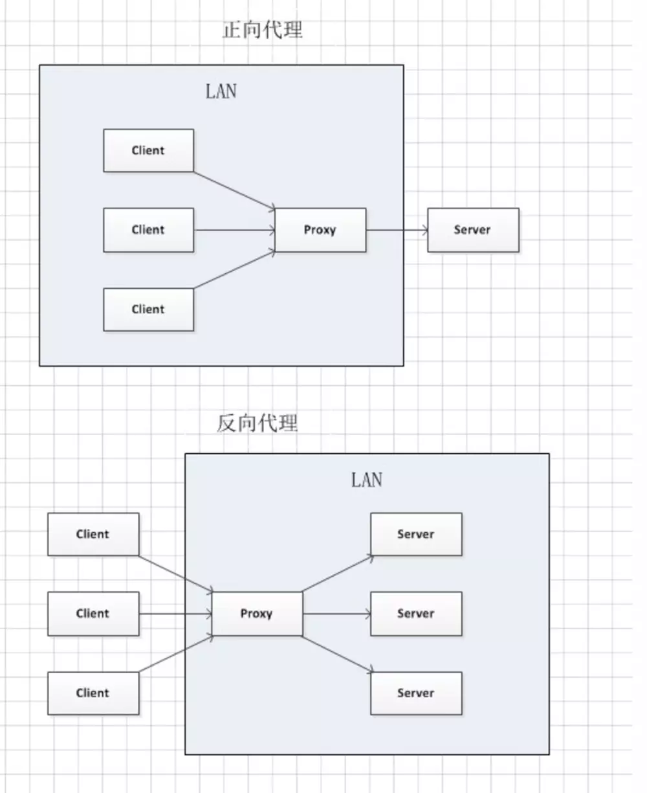

## nginx 篇

### nginx按天保存日志的实现？

https://blog.csdn.net/zzhongcy/article/details/86303204

1.Nginx内部配置设置日志文件格式。

2.写脚本，通过定时任务按天重命名日志、重启nginx的方法实现（有重启失败的风险）

3.通过工具cronolog实现。


### nginx在部署的时候有哪些必要的配置？

https://www.cnblogs.com/taiyonghai/p/5610112.html

worker进程数，通常设置<=CPU数量，auto为自动检测，一般设置最大8个即可，再大性能提升较小或不稳定

worker_processes auto;

将每个进程绑定到特定cpu上，避免进程在cpu间切换的开销

worker_cpu_affinity 00000001 00000010 00000100 00001000 00010000 00100000 01000000 10000000;

使用非阻塞模型，设置复用客户端线程的轮训方法

use epoll;

设置nginx采用gzip压缩的形式发送数据，减少发送数据量，但会增加请求处理时间及CPU处理时间，需要权衡

gzip on;


日志等配置


### nginx 的负载均衡如何配置？

https://segmentfault.com/a/1190000014483200

nginx负载均衡的5种策略

1、轮询（默认）

2、weight

3、ip_hash

4、fair（第三方）

5、url_hash（第三方）


## 什么是正向代理和反向代理？

https://www.jianshu.com/p/208c02c9dd1d

反向代理是客户端把反向代理当做服务器

正向代理是客户端通过代理服务器访问其他站点的数据

正向代理和反向代理最关键的两点区别：

是否指定目标服务器
客户端是否要做设置




## 描述epoll和poll、select的区别?为什么epoll会具备性能优势？

 epoll是异步事件被动触发，poll、select使用循环遍历查找就绪的连接，连接数越多越慢，epoll因为被动触发，就没有这个问题了。
	select，poll，epoll都是IO多路复用的机制
	select，poll实现需要自己不断轮询所有fd集合，直到设备就绪，期间可能要睡眠和唤醒多次交替。
	epoll其实也需要调用epoll_wait不断轮询就绪链表，期间也可能多次睡眠和唤醒交替，但是它是设备就绪时，调用回调函数，把就绪fd放入就绪链表中，并唤醒在epoll_wait中进入睡眠的进程。

​	参考：https://www.cnblogs.com/Anker/p/3265058.html


## 硬链接和软连接区别？

文件都有文件名与数据，这在 Linux 上被分成两个部分：

用户数据 (user data) 与元数据 (metadata)。

用户数据，即文件数据块 (data block)，数据块是记录文件真实内容的地方；

元数据则是文件的附加属性，如文件大小、创建时间、所有者等信息。在 Linux 中，元数据中的 inode 号（inode 是文件元数据的一部分但其并不包含文件名，inode 号即索引节点号）才是文件的唯一标识而非文件名。

https://blog.csdn.net/kension/article/details/3796603


## linux 命令

### linux常用命令

### 系统管理命令（如查看内存使用、网络情况）。

free -m

sudo su  chmod setfacl  chown chgrp

iftop

netstat -lntup 

shutdown reboo

### 进程管理

w top  ps kill pkill pstree killall

### 用户管理

useradd passwd  userdel id groupadd

### 文件系统

mount umount fsck df du

### 网络应用

curl telnet mail elinks

ping netstat host 

### 网络配置

hostname ifconfig

### 常用工具

ssh screen clear who date

### 软件包管理

yum rpm apt-get

### 文件查找和比较

locate find

### 文件内容查看

head tail less more

### 文件处理

touch  unlink rename ln cat

### 目录操作 

cd mv rm pwd tree cp ls

### 压缩解压

bzip2 bunzip2  gzip/gunzip zip/unzip tar 

文件传输

ftp scp rsync


### 管道的使用

xargs 很多程序是不处理标准输入的，例如 kill , rm 这些程序如果命令行参数中没有指定要处理的内容则不会默认从标准输入中读取 

find .  -name 1.txt | xargs rm -f 


### grep 的使用

grep -v

grep -a


## Linux系统定时任务

crontab

crontab -e

```
* * * * * 命令 分 时 日 月 周
```

at 只执行一次

```
at 2:00 tomorrow  

at>sh test.sh 

at>ctrl+d
```


### vi/vim编辑器

一般模式 编辑模式、命令行模式  视图模式


### shell 基础

解释器  bash  csh  ash bsh ksh

```
chmod +x test.sh  

./test.sh

#!/bin/bash
```


### find 命令


### Sed 命令


### awk 使用


### kill 用法，某个进程杀不掉的原因（进入内核态，忽略 kill 信号）


### ps ajf 显示进程树


## strace -p


### 如何查看linux负载？

uptime  5分钟 

top

按内存排序 M

按cpu排序 P


## gdb调试


## linux 内核


## GIT相关

## git rebase 啥意思？

合并多次提交记录

http://jartto.wang/2018/12/11/git-rebase/

replace base 变基

https://git-scm.com/book/zh/v2/Git-%E5%88%86%E6%94%AF-%E5%8F%98%E5%9F%BA

解决分支基础


1.本地与远程的差集 :（显示远程有而本地没有的commit信息）
git log local_branch..origin/remote_branch


统计文件的改动
git diff --stat local_branch origin/remote_branch


