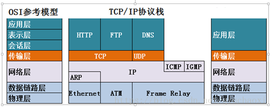
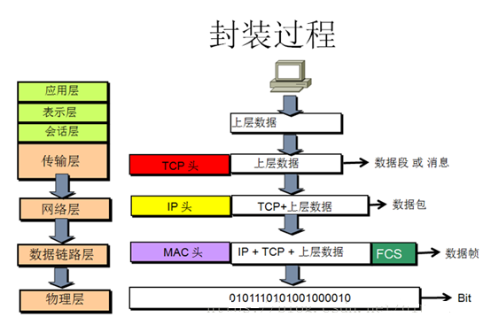
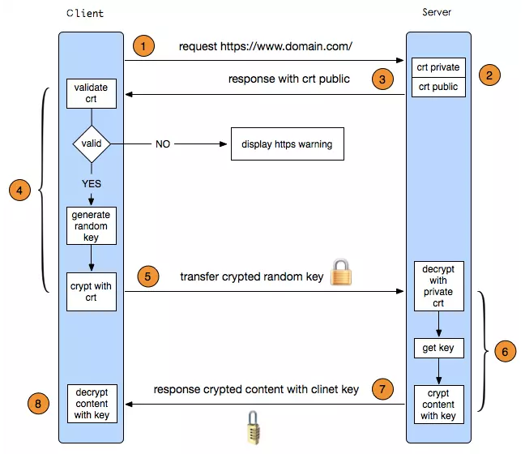
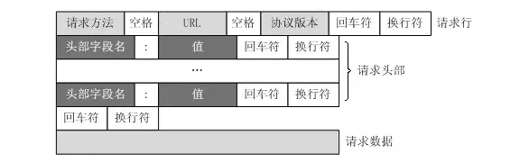

# 计算机网络专题

了不了解tcp/udp，说下两者的定义，tcp为什么要三次握手和四次挥手？

tcp怎么保证有序传输的，讲下tcp的快速重传和拥塞机制

知不知道time_wait状态，这个状态出现在什么地方，有什么用？

udp是不可靠的传输，如果你来设计一个基于udp差不多可靠的算法，怎么设计？

http与https有啥区别？说下https解决了什么问题，怎么解决的？说下https的握手过程。

## OSI相关

### OSI与TCP/IP各层的结构和功能，都有哪些协议，协议所占端口号

| 层级       | 数据格式                                                     |
| ---------- | ------------------------------------------------------------ |
| 应用层     | 所有能产生网络流量的程序（QQ，淘宝等）                       |
| 表示层     | 在传输之前是否进行加密或压缩处理， 图片文件二进制，英文文档用ASCII传送（可节省带宽，比如QQ视频，账号密码，可把人像加密快速传输） |
| 会话层     | 查看木马（打开一个网页就是打开一个会话），netstat-n，可看到建立这个会话的程序，放置时木马 |
| 传输层     | Segment（数据段）                                            |
| 网络层     | 负责选择最佳路径，规划IP地址（IPV4，IPV6）                   |
| 数据链路层 | 帧的开始与结束，透明传输，差错校验（只负责检查，不纠正，错误就扔掉） |
| 物理层     | 接口标准，电器标准，如何在物理链路上传输更快的速度           |

TCP/IP协议数据单元

| 层级       | 协议              | 数据格式          |
| ---------- | ----------------- | ----------------- |
| 应用层     | HTTP, FTP, SMTP等 | Data（数据）      |
| 传输层     | TCP, UDP          | Segment（数据段） |
| 网络层     | IP                | Packet（数据包）  |
| 数据链路层 | MAC               | Frame（数据帧）   |
| 物理层     | 光纤/电缆/微波    | bit（数据位）     |

| 应用层协议 | 服务                           | 端口号                  | TCP/UDP |
| ---------- | ------------------------------ | ----------------------- | ------- |
| FTP        | 文件传输协议                   | 20（数据） + 21（控制） | TCP     |
| SSH        | 安全登录，文件传送和端口重定向 | 22                      | TCP     |
| Telnet     | 远程登录协议，不安全的文本传送 | 23                      | TCP     |
| SMTP       | 简单邮件传送协议               | 25                      | TCP     |
| DNS        | 域名解析协议                   | 53                      | TCP     |
| HTTP       | 超文本传输协议                 | 80                      | TCP     |
| POP3       | 邮局协议第3版                  | 110                     | TCP     |
| IMAP       | 网络邮件接入协议               | 143                     | TCP     |
| HTTPS      | 安全的超文本传输协议（SSL）    | 443                     | TCP     |

| 应用层协议 | 服务             | 端口号 | TCP/UDP |
| ---------- | ---------------- | ------ | ------- |
| DNS        | 域名解析协议     | 53     | UDP     |
| DHCP       | 动态主机配置协议 | 53     | UDP     |
| TFTP       | 简单文件传输协议 | 67     | UDP     |
| NTP        | 网络时间协议     | 123    | UDP     |
| SNMP       | 简单网络管理协议 | 161    | UDP     |

## TCP

### 画出三次握手和四次挥手的图

### TCP如何保证可靠传输

https://www.cnblogs.com/deliver/p/5471231.html

1、确认和重传：接收方收到报文就会确认，发送方发送一段时间后没有收到确认就重传。

2、数据校验

3、数据合理分片和排序：

　　UDP：IP数据报大于1500字节,大于MTU.这个时候发送方IP层就需要分片(fragmentation).把数据报分成若干片,使每一片都小于MTU.而接收方IP层则需要进行数据报的重组.这样就会多做许多事情,而更严重的是,由于UDP的特性,当某一片数据传送中丢失时,接收方便无法重组数据报.将导致丢弃整个UDP数据报.

　　tcp会按MTU合理分片，接收方会缓存未按序到达的数据，重新排序后再交给应用层。

4、流量控制：当接收方来不及处理发送方的数据，能提示发送方降低发送的速率，防止包丢失。

5、拥塞控制：当网络拥塞时，减少数据的发送。

## SSL原理

这里说一下SSL通讯过程。

客户端与服务端建立连接
互相Hello(包含支持的版本、算法；加上随机数)
服务端发送公钥
客户端发送公钥(双向验证才需要，单向跳过)
服务端验证客户端公钥(双向验证才需要，单向跳过)
客户端验证服务端公钥
交换DH参数(如果用DH密钥交换算法)
客户端生成PreMaster Secret，并发送给服务端(DH根据随机数和参数直接算)
服务端解密PreMaster Secret，得到对称密钥(DH根据随机数和参数直接算)
使用对称密钥通讯

## HTTP/2新特性

二进制分帧、多路复用、流优先级、服务器推送、头部压缩、应用层协商协议
*强制SSL，虽然规范没有强制，但是所有浏览器均只支持SSL下的HTTP/2
HTTP/2 Frequently Asked Questions

### TCP三次握手有什么漏洞？

1.SYN FLOOD攻击
    SYN-FLOOD是一种常见的DDos攻击，拒绝服务攻击。通过网络服务所在的端口发送大量伪造原地址的攻击报文，发送到服务端，造成服务端上的半开连接队列被占满，从而阻止其他用户进行访问。
    它的数据报特征是大量syn包，并且缺少最后一步的ACK回复。

原理：攻击者首先伪造地址，对服务器发起syn请求，服务器回应syn+ACK，而真实的IP会认为我没有发送请求，不做回应，而服务端没有收到回应，服务器就不知道是否发送成功，默认情况下重试5次 syn_retries，这样的话，对于服务器内存和带宽有很大的消耗。

  2.解决SYN FLOOD方法
    (1).无效连接监控
    不停监视半开连接和不活动连接，当半开连接数和不活动连接数到达一定值时候，就释放系统资源。
    伤敌1000，自损8000
    (2).延缓TCB方法
    SYN FLOOD的关键是利用了，syn数据报一到，系统就分配TCB资源。
    那么我们有两种方法资源问题
    Syn cache
    这种技术在收到Syn时不急着分配TCB，而是先回应一个ACK报文，并在一个专用的HASH表中保存这种连接，直到收到正确的ACK，才分配TCB。
    (3).Syn Cookie

用一种特殊的算法生成sequence number，算法考虑到对方的信息和己方信息，收到对方的ACK报文后，验证之后才决定是否生成TCB

### TCP与UDP的区别或各自的优缺点，各自的用途和使用 

1、TCP面向连接（如打电话要先拨号建立连接）;UDP是无连接的，即发送数据之前不需要建立连接

2、TCP提供可靠的服务。也就是说，通过TCP连接传送的数据，无差错，不丢失，不重复，且按序到达;UDP尽最大努力交付，即不保证可靠交付

3、TCP面向字节流，实际上是TCP把数据看成一连串无结构的字节流;UDP是面向报文的

UDP没有拥塞控制，因此网络出现拥塞不会使源主机的发送速率降低（对实时应用很有用，如IP电话，实时视频会议等）

4、每一条TCP连接只能是点到点的;UDP支持一对一，一对多，多对一和多对多的交互通信

5、TCP首部开销20字节;UDP的首部开销小，只有8个字节
6、TCP的逻辑通信信道是全双工的可靠信道，UDP则是不可靠信道

UDP运用

实时音视频是可以而且应该用 UDP 的，一方面因为它常常涉及到网络穿透，另外一方面它不需要重传。——我需要实时的看到你的图像跟声音，至于中间丢一帧什么的完全不重要。

网络真的非常非常可靠，以至于你完全不需要考虑 UDP 丢包问题的情况。
典型的例子应该是专门为有线局域网设计的协议。

你真的很在乎延迟，不能忍受重传，那么就用UDP，例如 NTP 协议。重传NTP消息纯属添乱。

### TCP如何实现流量控制和拥塞控制？tcp是如何做错误处理的？

https://blog.csdn.net/yechaodechuntian/article/details/25429143

https://www.zhihu.com/question/32255109

### TCP滑动窗口协议、窗口过大过小有什么影响

### TCP头部有哪些字段？

### UDP的首部多长？具体包含哪些字段？

### TCP如何利用不可靠的IP协议实现可靠传输

TCP/IP协议族

TCP是全双工的

IP协议之所以是不可靠的是因为IP网络存在冲突丢包及传输错误甚至被恶意篡改的情况；

语音视频丢包影响不大，重传反而有点怪

## HTTP

### HTTP协议的工作特点和工作原理

基于B/S模式

通信开销小、简单快速、传输成本低

使用灵活、可使用超文本传输协议

节省传输时间

无状态

### HTTP有哪些方法？这些方法的具体作用是什么？

HTTP1.0定义了三种请求方法： GET, POST 和 HEAD方法
HTTP1.1新增了五种请求方法：OPTIONS, PUT, DELETE, TRACE 和 CONNECT

GET: 通常用于请求服务器发送某些资源
HEAD: 请求资源的头部信息, 并且这些头部与 HTTP GET 方法请求时返回的一致. 该请求方法的一个使用场景是在下载一个大文件前先获取其大小再决定是否要下载, 以此可以节约带宽资源
OPTIONS: 用于获取目的资源所支持的通信选项
POST: 发送数据给服务器
PUT: 用于新增资源或者使用请求中的有效负载替换目标资源的表现形式
DELETE: 用于删除指定的资源
PATCH: 用于对资源进行部分修改
CONNECT: HTTP/1.1协议中预留给能够将连接改为管道方式的代理服务器
TRACE: 回显服务器收到的请求，主要用于测试或诊断

### HTTPS是什么？HTTPS和HTTP的区别

HTTPS 是 HTTP 建立在 SSL/TLS 安全协议上的。
在 iOS 中，客户端本地会存放着 CA 证书，在HTTPS 请求时，会首先像服务器索要公钥，获得公钥后会使用本地 CA 证书验证公钥的正确性，然后通过正确的公钥加密信息发送给服务器，服务器会使用私钥解密信息。
SSL/TLS握手阶段分为五步：以下引自 阮一峰的网络日志

第一步，爱丽丝给出协议版本号、一个客户端生成的随机数（Client random），以及客户端支持的加密方法。

第二步，鲍勃确认双方使用的加密方法，并给出数字证书、以及一个服务器生成的随机数（Server random）。

第三步，爱丽丝确认数字证书有效，然后生成一个新的随机数（Premaster secret），并使用数字证书中的公钥，加密这个随机数，发给鲍勃。

第四步，鲍勃使用自己的私钥，获取爱丽丝发来的随机数（即Premaster secret）。

第五步，爱丽丝和鲍勃根据约定的加密方法，使用前面的三个随机数，生成"对话密钥"（session key），用来加密接下来的整个对话过程。

HTTPS 相对于 HTTP 性能上差点，因为多了 SSL/TLS 的几次握手和加密解密的运算处理，但是加密解密的运算处理已经可以通过特有的硬件来加速处理。

HTTP 是不保存状态的协议和 Cookie 的简单介绍
HTTP 协议对于发送的请求和响应不做持久化处理。这时候引入了 Cookie 技术用于状态管理。Cookie 对用与登录的状态管理，没有 Cookie 这个技术的话，因为 HTTP 不保存状态，每次打开新网页都必须再次登录。
Cookie 会根据响应报文中的 Set-Cookie 字段来通知客户端自动保存 Cookie。下次请求时会自动发送 Cookie，服务器会比对数据得到状态结果。

### Post 和 Get 的区别

先引入副作用和幂等的概念。
副作用指对服务器上的资源做改变，搜索是无副作用的，注册是副作用的。
幂等指发送 M 和 N 次请求（两者不相同且都大于1），服务器上资源的状态一致。注册10个和11个帐号是不幂等的，对文章进行更改10次和11次是幂等的。
在规范的应用场景上说，Get 多用于无副作用，幂等的场景，例如搜索关键字。Post 多用于副作用，不幂等的场景，例如注册。
在技术上说：

Get 请求能缓存，Post 不能
Post 相对 Get 安全一点点，因为Get 请求都包含在 URL 里，且会被浏览器保存历史纪录，Post 不会，但是在抓包的情况下都是一样的。
Post 可以通过 request body来传输比 Get 更多的数据，Get 没有这个技术
URL有长度限制，会影响 Get 请求，但是这个长度限制是浏览器规定的，不是 RFC 规定的
Post 支持更多的编码类型且不对数据类型限制

数据传输方式不同：GET请求通过URL传输数据，而POST的数据通过请求体传输。
安全性不同：POST的数据因为在请求主体内，所以有一定的安全性保证，而GET的数据在URL中，通过历史记录，缓存很容易查到数据信息。
数据类型不同：GET只允许 ASCII 字符，而POST无限制
GET无害： 刷新、后退等浏览器操作GET请求是无害的，POST可能重复提交表单
特性不同：GET是安全（这里的安全是指只读特性，就是使用这个方法不会引起服务器状态变化）且幂等（幂等的概念是指同一个请求方法执行多次和仅执行一次的效果完全相同），而POST是非安全非幂等

### PUT和POST都是给服务器发送新增资源，有什么区别？

PUT 和POST方法的区别是,PUT方法是幂等的：连续调用一次或者多次的效果相同（无副作用），而POST方法是非幂等的。

除此之外还有一个区别，通常情况下，PUT的URI指向是具体单一资源，而POST可以指向资源集合。

/articles

/articles/820357430

### PUT和PATCH都是给服务器发送修改资源，有什么区别？

PUT和PATCH都是更新资源，而PATCH用来对已知资源进行局部更新。

### http的请求报文是什么样的？

请求报文有4部分组成:

请求行
请求头部
空行
请求体

请求行包括：请求方法字段、URL字段、HTTP协议版本字段。它们用空格分隔。例如，GET /index.html HTTP/1.1。
请求头部:请求头部由关键字/值对组成，每行一对，关键字和值用英文冒号“:”分隔

User-Agent：产生请求的浏览器类型。
Accept：客户端可识别的内容类型列表。
Host：请求的主机名，允许多个域名同处一个IP地址，即虚拟主机。

请求体: post put等请求携带的数据

http的响应报文是什么样的？
请求报文有4部分组成:

响应行
响应头
空行
响应体

响应行： 由协议版本，状态码和状态码的原因短语组成，例如HTTP/1.1 200 OK。
响应头：响应部首组成
响应体：服务器响应的数据

聊一聊HTTP的部首有哪些？

内容很多，重点看标『✨』内容

通用首部字段（General Header Fields）：请求报文和响应报文两方都会使用的首部

Cache-Control  控制缓存 ✨
Connection 连接管理、逐条首部 ✨
Upgrade  升级为其他协议
via 代理服务器的相关信息
Wraning 错误和警告通知
Transfor-Encoding 报文主体的传输编码格式 ✨
Trailer 报文末端的首部一览
Pragma 报文指令
Date 创建报文的日期

请求首部字段（Reauest Header Fields）:客户端向服务器发送请求的报文时使用的首部

Accept 客户端或者代理能够处理的媒体类型 ✨
Accept-Encoding 优先可处理的编码格式
Accept-Language 优先可处理的自然语言
Accept-Charset 优先可以处理的字符集
If-Match 比较实体标记（ETage） ✨
If-None-Match 比较实体标记（ETage）与 If-Match相反 ✨
If-Modified-Since 比较资源更新时间（Last-Modified）✨
If-Unmodified-Since比较资源更新时间（Last-Modified），与 If-Modified-Since相反 ✨
If-Rnages 资源未更新时发送实体byte的范围请求
Range 实体的字节范围请求 ✨
Authorization web的认证信息 ✨
Proxy-Authorization 代理服务器要求web认证信息
Host 请求资源所在服务器 ✨
From 用户的邮箱地址
User-Agent 客户端程序信息 ✨
Max-Forwrads 最大的逐跳次数
TE 传输编码的优先级
Referer 请求原始放的url
Expect 期待服务器的特定行为

响应首部字段（Response Header Fields）:从服务器向客户端响应时使用的字段

Accept-Ranges 能接受的字节范围
Age 推算资源创建经过时间
Location 令客户端重定向的URI ✨
vary  代理服务器的缓存信息
ETag 能够表示资源唯一资源的字符串 ✨
WWW-Authenticate 服务器要求客户端的验证信息
Proxy-Authenticate 代理服务器要求客户端的验证信息
Server 服务器的信息 ✨
Retry-After 和状态码503 一起使用的首部字段，表示下次请求服务器的时间

实体首部字段（Entiy Header Fields）:针对请求报文和响应报文的实体部分使用首部

Allow 资源可支持http请求的方法 ✨
Content-Language 实体的资源语言
Content-Encoding 实体的编码格式
Content-Length 实体的大小（字节）
Content-Type 实体媒体类型
Content-MD5 实体报文的摘要
Content-Location 代替资源的yri
Content-Rnages 实体主体的位置返回
Last-Modified 资源最后的修改资源 ✨
Expires 实体主体的过期资源 ✨

同样是重定向307，303，302的区别？
302是http1.0的协议状态码，在http1.1版本的时候为了细化302状态码又出来了两个303和307。
303明确表示客户端应当采用get方法获取资源，他会把POST请求变为GET请求进行重定向。
307会遵照浏览器标准，不会从post变为get。

HTTP的keep-alive是干什么的？
在早期的HTTP/1.0中，每次http请求都要创建一个连接，而创建连接的过程需要消耗资源和时间，为了减少资源消耗，缩短响应时间，就需要重用连接。在后来的HTTP/1.0中以及HTTP/1.1中，引入了重用连接的机制，就是在http请求头中加入Connection: keep-alive来告诉对方这个请求响应完成后不要关闭，下一次咱们还用这个请求继续交流。协议规定HTTP/1.0如果想要保持长连接，需要在请求头中加上Connection: keep-alive。
keep-alive的优点：

较少的CPU和内存的使用（由于同时打开的连接的减少了）
允许请求和应答的HTTP管线化
降低拥塞控制 （TCP连接减少了）
减少了后续请求的延迟（无需再进行握手）
报告错误无需关闭TCP连

为什么有了HTTP为什么还要HTTPS？
https是安全版的http，因为http协议的数据都是明文进行传输的，所以对于一些敏感信息的传输就很不安全，HTTPS就是为了解决HTTP的不安全而生的。
HTTPS是如何保证安全的？
过程比较复杂，我们得先理解两个概念
对称加密：即通信的双方都使用同一个秘钥进行加解密，比如特务接头的暗号，就属于对称加密
对称加密虽然很简单性能也好，但是无法解决首次把秘钥发给对方的问题，很容易被hacker拦截秘钥。
非对称加密：

私钥 + 公钥= 密钥对
即用私钥加密的数据,只有对应的公钥才能解密,用公钥加密的数据,只有对应的私钥才能解密
因为通信双方的手里都有一套自己的密钥对,通信之前双方会先把自己的公钥都先发给对方
然后对方再拿着这个公钥来加密数据响应给对方,等到到了对方那里,对方再用自己的私钥进行解密

非对称加密虽然安全性更高，但是带来的问题就是速度很慢，影响性能。
解决方案：
那么结合两种加密方式，将对称加密的密钥使用非对称加密的公钥进行加密，然后发送出去，接收方使用私钥进行解密得到对称加密的密钥，然后双方可以使用对称加密来进行沟通。
此时又带来一个问题，中间人问题：
如果此时在客户端和服务器之间存在一个中间人,这个中间人只需要把原本双方通信互发的公钥,换成自己的公钥,这样中间人就可以轻松解密通信双方所发送的所有数据。
所以这个时候需要一个安全的第三方颁发证书（CA），证明身份的身份，防止被中间人攻击。
证书中包括：签发者、证书用途、使用者公钥、使用者私钥、使用者的HASH算法、证书到期时间等

但是问题来了，如果中间人篡改了证书，那么身份证明是不是就无效了？这个证明就白买了，这个时候需要一个新的技术，数字签名。
数字签名就是用CA自带的HASH算法对证书的内容进行HASH得到一个摘要，再用CA的私钥加密，最终组成数字签名。
当别人把他的证书发过来的时候,我再用同样的Hash算法,再次生成消息摘要，然后用CA的公钥对数字签名解密,得到CA创建的消息摘要,两者一比,就知道中间有没有被人篡改了。
这个时候就能最大程度保证通信的安全了。

### HTTP的响应报文是什么样的？

### HTTP2相对于HTTP1.x有什么优势和特点？

二进制分帧
帧：HTTP/2 数据通信的最小单位消息：指 HTTP/2 中逻辑上的 HTTP 消息。例如请求和响应等，消息由一个或多个帧组成。
流：存在于连接中的一个虚拟通道。流可以承载双向消息，每个流都有一个唯一的整数ID
HTTP/2 采用二进制格式传输数据，而非 HTTP 1.x 的文本格式，二进制协议解析起来更高效。
服务器推送
服务端可以在发送页面HTML时主动推送其它资源，而不用等到浏览器解析到相应位置，发起请求再响应。例如服务端可以主动把JS和CSS文件推送给客户端，而不需要客户端解析HTML时再发送这些请求。
服务端可以主动推送，客户端也有权利选择是否接收。如果服务端推送的资源已经被浏览器缓存过，浏览器可以通过发送RST_STREAM帧来拒收。主动推送也遵守同源策略，服务器不会随便推送第三方资源给客户端。
头部压缩
HTTP/1.x会在请求和响应中中重复地携带不常改变的、冗长的头部数据，给网络带来额外的负担。

HTTP/2在客户端和服务器端使用“首部表”来跟踪和存储之前发送的键－值对，对于相同的数据，不再通过每次请求和响应发送
首部表在HTTP/2的连接存续期内始终存在，由客户端和服务器共同渐进地更新;
每个新的首部键－值对要么被追加到当前表的末尾，要么替换表中之前的值。

你可以理解为只发送差异数据，而不是全部发送，从而减少头部的信息量

多路复用
HTTP 1.x 中，如果想并发多个请求，必须使用多个 TCP 链接，且浏览器为了控制资源，还会对单个域名有 6-8个的TCP链接请求限制。
HTTP2中：

同域名下所有通信都在单个连接上完成。
单个连接可以承载任意数量的双向数据流。
数据流以消息的形式发送，而消息又由一个或多个帧组成，多个帧之间可以乱序发送，因为根据帧首部的流标识可以重新组装

链接：https://juejin.im/post/5d032b77e51d45777a126183

## HTTP2.0

- **新的二进制格式**（Binary Format），HTTP1.x的解析是基于文本。基于文本协议的格式解析存在天然缺陷，文本的表现形式有多样性，要做到健壮性考虑的场景必然很多，二进制则不同，只认0和1的组合。基于这种考虑HTTP2.0的协议解析决定采用二进制格式，实现方便且健壮。
- **多路复用**（MultiPlexing），即连接共享，即每一个request都是是用作连接共享机制的。一个request对应一个id，这样一个连接上可以有多个request，每个连接的request可以随机的混杂在一起，接收方可以根据request的 id将request再归属到各自不同的服务端请求里面。**多路复用原理图**：
- **header压缩，**如上文中所言，对前面提到过HTTP1.x的header带有大量信息，而且每次都要重复发送，HTTP2.0使用encoder来减少需要传输的header大小，通讯双方各自cache一份header fields表，既避免了重复header的传输，又减小了需要传输的大小。
- **服务端推送**（server push），同SPDY一样，HTTP2.0也具有server push功能。目前，有大多数网站已经启用HTTP2.0，例如[YouTuBe](https://www.youtube.com/)，[淘宝网](http://www.taobao.com/)等网站，利用chrome控制台可以查看是否启用H2

### HTTP有关缓存的首部字段有哪些？HTTP的浏览器缓存机制？

### HTTP协议中几个状态码的含义?

1xx（临时响应） - 表示临时响应并需要请求者继续执行操作的状态代码。

代码   说明

100   （继续） 请求者应当继续提出请求。 服务器返回此代码表示已收到请求的第一部分，正在等待其余部分。101   （切换协议） 请求者已要求服务器切换协议，服务器已确认并准备切换。

2xx （成功）

表示成功处理了请求的状态代码。

代码   说明

200   （成功）  服务器已成功处理了请求。 通常，这表示服务器提供了请求的网页。

201   （已创建）  请求成功并且服务器创建了新的资源。

202   （已接受）  服务器已接受请求，但尚未处理。

203   （非授权信息）  服务器已成功处理了请求，但返回的信息可能来自另一来源。

204   （无内容）  服务器成功处理了请求，但没有返回任何内容。

205   （重置内容） 服务器成功处理了请求，但没有返回任何内容。

206   （部分内容）  服务器成功处理了部分 GET 请求。

3xx （重定向）

表示要完成请求，需要进一步操作。 通常，这些状态代码用来重定向。

代码   说明

300   （多种选择）  针对请求，服务器可执行多种操作。 服务器可根据请求者 (user agent) 选择一项操作，或提供操作列表供请求者选择。

301   （永久移动）  请求的网页已永久移动到新位置。 服务器返回此响应（对 GET 或 HEAD 请求的响应）时，会自动将请求者转到新位置。

302   （临时移动）  服务器目前从不同位置的网页响应请求，但请求者应继续使用原有位置来进行以后的请求。

303   （查看其他位置） 请求者应当对不同的位置使用单独的 GET 请求来检索响应时，服务器返回此代码。

304   （未修改） 自从上次请求后，请求的网页未修改过。 服务器返回此响应时，不会返回网页内容。

305   （使用代理） 请求者只能使用代理访问请求的网页。 如果服务器返回此响应，还表示请求者应使用代理。

307   （临时重定向）  服务器目前从不同位置的网页响应请求，但请求者应继续使用原有位置来进行以后的请求。

4xx（请求错误）

这些状态代码表示请求可能出错，妨碍了服务器的处理。

代码   说明

400   （错误请求） 服务器不理解请求的语法。

401   （未授权） 请求要求身份验证。 对于需要登录的网页，服务器可能返回此响应。

403   （禁止） 服务器拒绝请求。

404   （未找到） 服务器找不到请求的网页。

405   （方法禁用） 禁用请求中指定的方法。

406   （不接受） 无法使用请求的内容特性响应请求的网页。

407   （需要代理授权） 此状态代码与 401（未授权）类似，但指定请求者应当授权使用代理。

408   （请求超时）  服务器等候请求时发生超时。

409   （冲突）  服务器在完成请求时发生冲突。 服务器必须在响应中包含有关冲突的信息。

410   （已删除）  如果请求的资源已永久删除，服务器就会返回此响应。

411   （需要有效长度） 服务器不接受不含有效内容长度标头字段的请求。

412   （未满足前提条件） 服务器未满足请求者在请求中设置的其中一个前提条件。

413   （请求实体过大） 服务器无法处理请求，因为请求实体过大，超出服务器的处理能力。

414   （请求的 URI 过长） 请求的 URI（通常为网址）过长，服务器无法处理。

415   （不支持的媒体类型） 请求的格式不受请求页面的支持。

416   （请求范围不符合要求） 如果页面无法提供请求的范围，则服务器会返回此状态代码。

417   （未满足期望值） 服务器未满足"期望"请求标头字段的要求。

5xx（服务器错误）

这些状态代码表示服务器在尝试处理请求时发生内部错误。 这些错误可能是服务器本身的错误，而不是请求出错。

代码   说明

500   （服务器内部错误）  服务器遇到错误，无法完成请求。

501   （尚未实施） 服务器不具备完成请求的功能。 例如，服务器无法识别请求方法时可能会返回此代码。

502   （错误网关） 服务器作为网关或代理，从上游服务器收到无效响应。

503   （服务不可用） 服务器目前无法使用（由于超载或停机维护）。 通常，这只是暂时状态。

504   （网关超时）  服务器作为网关或代理，但是没有及时从上游服务器收到请求。

505   （HTTP 版本不受支持） 服务器不支持请求中所用的 HTTP 协议版本。

## HTTP的基本优化

影响一个HTTP网络请求的因素主要有两个：带宽和延迟。

- **带宽：**如果说我们还停留在拨号上网的阶段，带宽可能会成为一个比较严重影响请求的问题，但是现在网络基础建设已经使得带宽得到极大的提升，我们不再会担心由带宽而影响网速，那么就只剩下延迟了。
- **延迟：**

1. **浏览器阻塞（HOL blocking）**：浏览器会因为一些原因阻塞请求。浏览器对于同一个域名，同时只能有 4 个连接（这个根据浏览器内核不同可能会有所差异），超过浏览器最大连接数限制，后续请求就会被阻塞。

2. **DNS 查询（DNS Lookup）**：浏览器需要知道目标服务器的 IP 才能建立连接。将域名解析为 IP 的这个系统就是 DNS。这个通常可以利用DNS缓存结果来达到减少这个时间的目的。

3. **建立连接（Initial connection）**：HTTP 是基于 TCP 协议的，浏览器最快也要在第三次握手时才能捎带 HTTP 请求报文，达到真正的建立连接，但是这些连接无法复用会导致每次请求都经历三次握手和[慢启动](http://en.wikipedia.org/wiki/Slow-start)。三次握手在高延迟的场景下影响较明显，慢启动则对文件类大请求影响较大。

   

4. 

### 为什么HTTP是无状态的？如何保持状态？

### http长连接和短连接的原理

浏览器和服务器在基于https进行请求连接到数据传输过程中用到了哪些技术？

HTTP和socket的区别，两个协议哪个更高效一些

### HTTP协议1.0及1.1的区别，并简单说下HTTP协议。http1.1的4个新特性

HTTP，超文本传输协议。它定义了浏览器和服务器的通信规则。HTTP协议是基于TCP/IP的TCP协议上，现在万维网使用的是HTTP1.1版本，其特点包括，C/S模式，请求简单(GET/POST/HEAD),灵活(可以传输任何类型的数据HTML、XML、JSON、自定义等)，无连接(每次连接只处理一个请求，从发出请求到收到200状态为止断开连接)，无状态。

HTTP1.0最早在网页中使用是在1996年，那个时候只是使用一些较为简单的网页上和网络请求上，而HTTP1.1则在1999年才开始广泛应用于现在的各大浏览器网络请求中，同时HTTP1.1也是当前使用最为广泛的HTTP协议。

**主要区别主要体现在：**

1. **缓存处理，**在HTTP1.0中主要使用header里的If-Modified-Since,Expires来做为缓存判断的标准，HTTP1.1则引入了更多的缓存控制策略例如Entity tag，If-Unmodified-Since, If-Match, If-None-Match等更多可供选择的缓存头来控制缓存策略。
2. **带宽优化及网络连接的使用**，HTTP1.0中，存在一些浪费带宽的现象，例如客户端只是需要某个对象的一部分，而服务器却将整个对象送过来了，并且不支持断点续传功能，HTTP1.1则在请求头引入了range头域，它允许只请求资源的某个部分，即返回码是206（Partial Content），这样就方便了开发者自由的选择以便于充分利用带宽和连接。
3. **错误通知的管理**，在HTTP1.1中新增了24个错误状态响应码，如409（Conflict）表示请求的资源与资源的当前状态发生冲突；410（Gone）表示服务器上的某个资源被永久性的删除。
4. **Host头处理**，在HTTP1.0中认为每台服务器都绑定一个唯一的IP地址，因此，请求消息中的URL并没有传递主机名（hostname）。但随着虚拟主机技术的发展，在一台物理服务器上可以存在多个虚拟主机（Multi-homed Web Servers），并且它们共享一个IP地址。HTTP1.1的请求消息和响应消息都应支持Host头域，且请求消息中如果没有Host头域会报告一个错误（400 Bad Request）。
5. **长连接**，HTTP 1.1支持长连接（PersistentConnection）和请求的流水线（Pipelining）处理，在一个TCP连接上可以传送多个HTTP请求和响应，减少了建立和关闭连接的消耗和延迟，在HTTP1.1中默认开启Connection： keep-alive，一定程度上弥补了HTTP1.0每次请求都要创建连接的缺点。以下是常见的HTTP1.0：

### HTTP断点续传的原理

## IP地址的分类

| 类别 | 最大网络数    | IP地址范围                | 单个网段最大主机数 | 私有IP地址范围              |
| ---- | ------------- | ------------------------- | ------------------ | --------------------------- |
| A    | 126（2^7-2)   | 1.0.0.1-127.255.255.254   | 16777214           | 10.0.0.0-10.255.255.255     |
| B    | 16384(2^14)   | 128.0.0.0-191.255.255.255 | 65534              | 172.16.0.0-172.31.255.255   |
| C    | 2097152(2^21) | 192.0.0.0-223.255.255.255 | 254                | 192.168.0.0-192.168.255.255 |

特殊的网址
每一个字节都为0的地址（“0.0.0.0”）对应于当前主机；
IP地址中的每一个字节都为1的IP地址（“255．255．255．255”）是当前子网的广播地址；
IP地址中凡是以“11110”开头的E类IP地址都保留用于将来和实验使用。
IP地址中不能以十进制“127”作为开头，该类地址中数字127．0．0．1到127．255．255．255用于回路测试，如：127.0.0.1可以代表本机IP地址，用“http://127.0.0.1”就可以测试本机中配置的Web服务器。
网络ID的第一个6位组也不能全置为“0”，全“0”表示本地网络。

## 什么是RESTfull架构风格

是一组架构约束条件和设计指导原则

https://www.ruanyifeng.com/blog/2011/09/restful.html 

客户端用到的手段，只能是HTTP协议。具体来说，就是HTTP协议里面，四个表示操作方式的动词：GET、POST、PUT、DELETE。它们分别对应四种基本操作：

GET用来获取资源，

POST用来新建资源（也可以用于更新资源），

PUT用来更新资源，

DELETE用来删除资源。

我们总结一下什么是RESTful架构：

　　（1）每一个URI代表一种资源；

　　（2）客户端和服务器之间，传递这种资源的某种表现层；

　　（3）客户端通过四个HTTP动词，对服务器端资源进行操作，实现"表现层状态转化"。

## Comet 和 WebSocket

https://www.cnblogs.com/ghj1976/archive/2013/03/25/2981245.html

## 以太网帧大小到底多大？

https://www.zhihu.com/question/58979135

## HTTP协议主要包括，响应消息格式、请求消息格式、状态码知识点。

[响应消息格式]

HTTP/1.1 200 0K

Connectlon:close

Date: Thu, 13 Oct 2005 03:17:33 GMT

Server: Apache/2.0.54 (Unix)

Last—Nodified:Mon,22 Jun 1998 09;23;24 GMT

Content—Length:682l

Content—Type:text/html

这个响应消息分为3部分：1个起始的状态行(status line)，6个头部行、1个包含所请求对象本身的附属体。状态行有3个字段:协议版本字段、状态码字段、原因短语字段。

[请求消息格式]

GET /somedir/page.html HTTP/1.1

Host:

Connection:close

User-agent:Mozilla/4.0

Accept-language:zh-cn

(额外的回车符和换行符)

该请求消息的第一行称为请求行 (request line)，后续各行都称为头部行(header)。请求行有3个字段:方法字段、URL字段、HTTP版本字段。

## 常见的网络协议含义及端口

FTP telnet  smtp  pop3  http dns 53

## 安全相关问题

### 攻击网站的方法和原理

1、DDOS攻击

2、XSS攻击

3、CSRF攻击

4、SQL注入攻击

### 怎样确保数据传输过程中的安全性？

1、数据加密

​	1.1 单向散列算法md5 sha1

1.2 对称加密算法

1.3 非对称加密算法

2.权限控制

## tcp 粘包问题怎么处理？

## 在浏览器输入URL后，执行的全部过程会用到哪些协议

## NAT地址转换

## 有几种会话跟踪技术？

