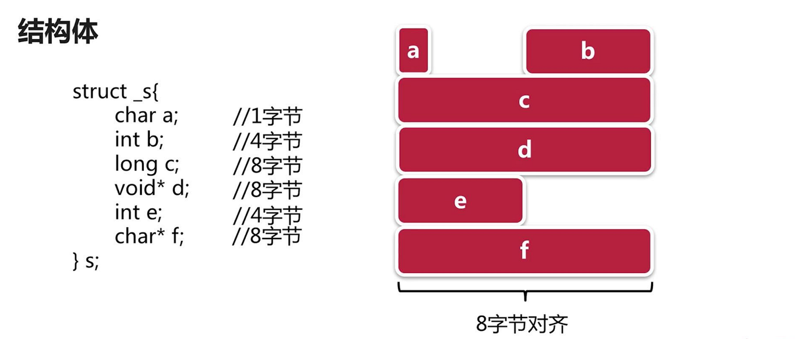
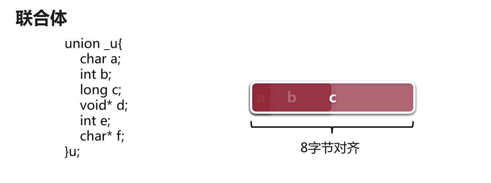

C语言基础

https://www.runoob.com/cprogramming/c-strings.html


C在线工具

https://www.runoob.com/try/runcode.php?filename=helloworld&type=c


变量的大小

```c
#include <stdio.h>

int main ()
{
   int  var1;
   char var2[10];

   printf("var1 变量的地址： %p\n", &var1  );
   printf("var2 变量的地址： %p\n", &var2  );
    
   printf("var1 变量的大小： %d\n", sizeof(var1)  );
   printf("var2 变量的大小： %d\n",  sizeof(var2)  );

   return 0;
}
```


结构体的内存对齐原则？

https://blog.csdn.net/Apollon_krj/article/details/51302859

```c
# include <stdio.h>

struct number_2
{
    char a;  // 1
    int b;   // 4
    double c; // 8
}st2;	

int main(){
    printf("%d\n",sizeof(st2)); //16
    return 0
}
```


联合体的内存管理？






复用内存


C语言内存碎片如何处理？

分页

https://www.zhihu.com/question/51836333